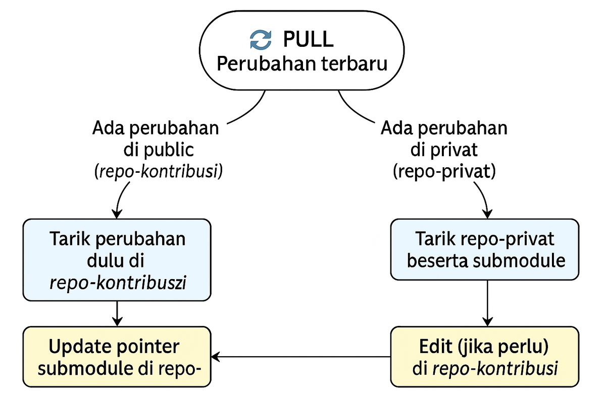

# Submodule

- **Repo Privat (root):** `C:\Users\username\workspace\repo-privat`
- **Submodule Publik:** `C:\Users\username\workspace\repo-privat\repo-kontribusi`

**Link:**

- Publik: `https://github.com/USERNAME/repo-kontribusi.git`
- Privat: `https://github.com/USERNAME/repo-privat.git`

---

## 1. Konsep Singkat

- **Repo Privat** (`repo-privat`): isi utama, hanya dapat diakses dengan izin.
- **Repo Publik** (`repo-kontribusi`): hanya folder kontribusi, histori terpisah, bisa di-push & kontribusi siapa saja.
- **Submodule**: repositori publik disisipkan ke dalam `repo-privat` sebagai folder `repo-kontribusi`.

---

## 2. Buat & Siapkan Repo Publik

### A. Di GitHub UI

1. Buat repository baru bernama **repo-kontribusi**, pilih **Public**, klik **Create**.

### B. Lokal (PowerShell)

```powershell
# Pindah ke workspace
cd C:\Users\username\workspace

# Buat folder & init Git
mkdir repo-kontribusi
cd repo-kontribusi
git init
git remote add origin https://github.com/USERNAME/repo-kontribusi.git

# Pindahkan isi folder dari privat (sesuaikan jika sudah ada)
# Misal: isi folder kontribusi awal ada di C:\Users\username\workspace\repo-privat\some-folder
# cp -r C:\Users\username\workspace\repo-privat\some-folder\* .

# Commit & push
git add .
git commit -m "Initial public version of kontribusi"
git push -u origin main
```

## 3. Tambahkan Submodule di Repo Privat

```powershell
# Masuk ke repo privat
cd C:\Users\username\workspace\repo-privat

# Inisialisasi jika belum
git init
git remote add origin https://github.com/USERNAME/repo-privat.git
git fetch
git checkout -b main origin/main

# Tambahkan submodule
git submodule add https://github.com/USERNAME/repo-kontribusi.git repo-kontribusi

# Stage .gitmodules & folder submodule
git add .gitmodules repo-kontribusi

# Commit & push
git commit -m "Add repo-kontribusi as submodule"
git push -u origin main
```

> **Jika** muncul error “dubious ownership” di Windows:
>
> ```powershell
> git config --global --add safe.directory "C:/Users/username/workspace/repo-privat/repo-kontribusi"
> ```

---

## 4. Clone Repo Privat + Submodule

```powershell
cd C:\Users\username\workspace
git clone --recurse-submodules https://github.com/USERNAME/repo-privat.git
cd repo-privat
```

Jika **sudah pernah** clone tanpa `--recurse`:

```powershell
git submodule init
git submodule update
```

---

## 5. Workflow Manual Saat Mengedit

### A. Kerja & Push di Submodule (Publik)

```powershell
# Masuk ke submodule
cd C:\Users\username\workspace\repo-privat\repo-kontribusi

# Edit file…

# Stage & commit
git add .
git commit -m "Deskripsi perubahan di public"

# Push ke GitHub repo publik
git push origin main
```

### B. Update Pointer di Repo Privat

```powershell
# Kembali ke root repo privat
cd C:\Users\username\workspace\repo-privat

# Stage perubahan pointer submodule
git add repo-kontribusi

# Commit pointer baru
git commit -m "Sync submodule repo-kontribusi to latest"

# Push ke GitHub repo privat
git push origin main
```

> **Urutan WAJIB:** lakukan **A** dulu, baru **B**.

---

## 6. Troubleshooting Manual

### 6.1 CRLF vs LF Warning

```powershell
git config --global core.autocrlf true
```

### 6.2 Bersihkan Submodule ‘Dirty’

```powershell
cd C:\Users\username\workspace\repo-privat\repo-kontribusi
git clean -n -d      # lihat untracked
git clean -f -d      # hapus untracked
git reset --hard HEAD
```

### 6.3 Memperbaiki Detached HEAD di Submodule

```powershell
cd C:\Users\username\workspace\repo-privat\repo-kontribusi
git fetch origin
git checkout main
# jika main belum ada:
git checkout -b main origin/main
git pull
```

### 6.4 Normalisasi Line Endings

```powershell
cd C:\Users\username\workspace\repo-privat\repo-kontribusi
git config core.autocrlf false
git add --renormalize .
git commit -m "Normalize line endings"
git push origin main
```

### 6.5 Memaksa Submodule Sync Manual

```powershell
# Reset & clean dari root
cd C:\Users\username\workspace\repo-privat
cd repo-kontribusi
git fetch origin
git reset --hard origin/main
git clean -f -d
cd ..

# Update pointer
git add repo-kontribusi
git commit -m "Force-sync repo-kontribusi to origin/main"
git push origin main
```

## Mulai kerja—alur commit & push

Setiap kali kamu membuat perubahan, **urutannya** adalah:

1. **Kerja & commit di submodule (repo publik) dulu**

   ```bash
   cd repo-kontribusi
   # edit file…
   git add .
   git commit -m "Deskripsi perubahan publik"
   git push       # kirim ke GitHub repo publik
   ```

2. **Kemudian update pointer submodule di repo privat**

   ```bash
   cd ..
   git add repo-kontribusi             # stage pointer SHA baru
   git commit -m "Sync submodule public → versi terbaru"
   git push                   # kirim ke GitHub repo privat
   ```

Dengan cara ini selalu:

- **Public** dulu (isi modul)
- **Privat** kemudian (update pointer)

---

## 4. Verifikasi status bersih

Setelah kedua push, cek:

```bash
git status                # di root harus “working tree clean”
git -C repo-kontribusi status      # di submodule juga “clean”
```

---

🔑 **Kunci**: **commit & push di public terlebih dahulu**, baru **commit pointer** di privat. Itu memastikan semua commit ada di remote sebelum pointer diperbarui. Kalau kamu melakukan `git pull` untuk menarik perubahan terbaru, **urutan pengerjaan tergantung dari di repo mana perubahan itu terjadi duluan**. Ini urutan umumnya:

---

## 🔁 **Jika ada perubahan di repo publik (`repo-kontribusi`) yang ingin kamu tarik:**

1. **Masuk ke folder submodule**

   ```powershell
   cd C:\Users\username\workspace\repo-privat\repo-kontribusi
   ```

2. **Tarik perubahan terbaru dari remote**

   ```bash
   git checkout main             # Pastikan kamu di branch yang benar
   git pull origin main
   ```

3. **Kembali ke repo privat dan update pointer SHA-nya**

   ```powershell
   cd ..  # kembali ke root repo privat
   git add repo-kontribusi
   git commit -m "Update submodule repo-kontribusi to latest changes"
   git push origin main
   ```

---

## 🔁 **Jika ada perubahan di repo privat (`repo-privat`) termasuk submodule pointer:**

1. **Tarik repo privat utama beserta submodule-nya**

   ```powershell
   cd C:\Users\username\workspace
   git pull origin main
   git submodule update --init --recursive --remote
   ```

2. **Verifikasi di folder submodule apakah sudah berada di commit yang benar**

   ```powershell
   cd repo-privat\repo-kontribusi
   git status   # harusnya "HEAD detached at [commit]" jika pointer belum di-checkout ke branch
   ```

3. **Jika perlu mengedit di public**, checkout ke branch:

   ```bash
   git checkout main
   ```

---

## 🔄 Singkatnya:

| Kasus                                      | Tarik/Update Duluan                                                           |
| ------------------------------------------ | ----------------------------------------------------------------------------- |
| Ada update di **public** (repo-kontribusi) | ✅ `git pull` di **repo-kontribusi** dulu, lalu update pointer di repo-privat |
| Ada update di **privat** (repo-privat)     | ✅ `git pull` di **repo-privat**, lalu `git submodule update --recursive`     |


