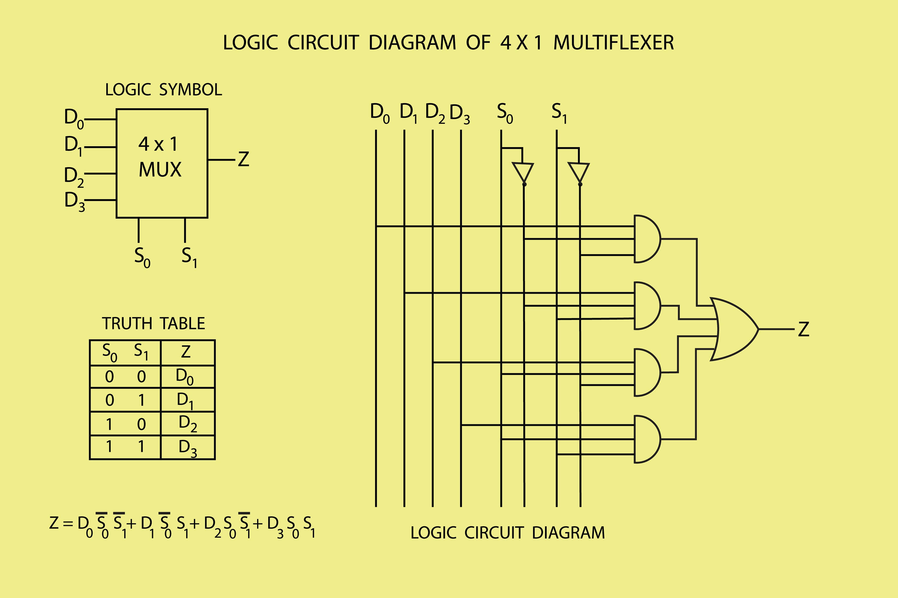
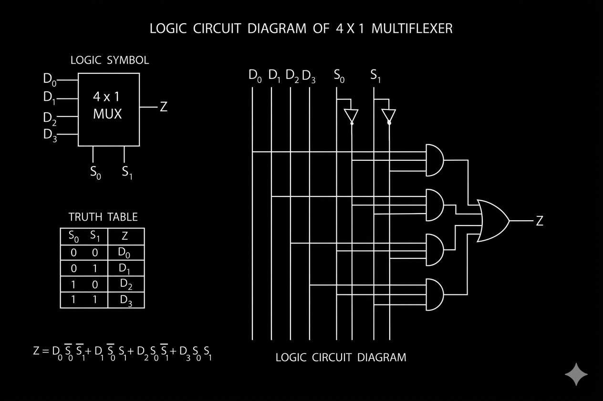

# Multiplexer

Dalam ilmu komputasi dan arsitektur sistem digital, **Multiplexer** (sering disingkat sebagai **MUX**) adalah sebuah komponen fundamental yang berfungsi sebagai pemilih jalur data. Ini adalah konsep abadi (*timeless*) yang menjadi pondasi bagi seluruh perangkat keras komputasi modern, mulai dari mikrokontroler sederhana hingga prosesor tingkat lanjut.

Secara konseptual, Anda dapat menganggap multiplexer seperti sebuah wesel pada jalur kereta api: banyak jalur kereta (input) yang datang dari berbagai arah, namun wesel tersebut (selektor) hanya mengizinkan satu jalur untuk masuk ke rel utama (output) pada satu waktu tertentu.

<!--  -->

---

### **Terminologi Teknis dan Konsep Dasar**

Untuk membaca dan memahami dokumentasi teknis atau diagram skematik, berikut adalah terminologi utama yang menyusun sebuah multiplexer:

* **Data Inputs (Input Data):** Jalur-jalur yang membawa sinyal informasi ke dalam sistem. Jumlah input selalu merepresentasikan pangkat dari dua, direpresentasikan secara matematis sebagai $2^n$.
* **Select Lines / Control Lines (Jalur Pemilih / Kontrol):** Jalur yang menentukan input mana yang akan diteruskan ke output. Jumlah jalur ini direpresentasikan sebagai $n$.
* **Output (Keluaran):** Satu jalur tunggal yang membawa sinyal dari input yang telah dipilih.
* **Data Selector (Pemilih Data):** Istilah bahasa Inggris lain untuk multiplexer, merujuk pada fungsi utamanya.

**Persamaan Logika (Boolean Expression)**
Sebagai contoh, pada sebuah *2-to-1 Multiplexer* (2 input data $I_0, I_1$ dan 1 select line $S$), persamaan logika matematikanya dituliskan menggunakan standar aljabar Boolean:

$$Y = (\overline{S} \cdot I_0) + (S \cdot I_1)$$

*Arti persamaan di atas:* Output ($Y$) akan bernilai sama dengan $I_0$ saat kondisi $S$ bernilai 0 ($\overline{S}$), ATAU bernilai sama dengan $I_1$ saat kondisi $S$ bernilai 1.

---

### **Alur Pendekatan: Bagaimana MUX Bekerja di Bawah Kap?**

Multiplexer dibangun menggunakan gerbang logika dasar (*Logic Gates*) seperti gerbang **AND**, **OR**, dan **NOT**.

1. Jalur selektor dihubungkan ke serangkaian gerbang NOT untuk menciptakan kombinasi biner (0 dan 1).
2. Setiap kombinasi biner ini dihubungkan ke sebuah gerbang AND bersama dengan satu jalur input data.
3. Hanya gerbang AND yang menerima sinyal pemilih bernilai '1' (*True*) yang akan mengaktifkan input datanya. Gerbang AND lainnya akan tertutup (bernilai '0').
4. Semua hasil dari gerbang AND tersebut disatukan menuju sebuah gerbang OR tunggal yang menjadi jalur output akhir.

Dalam dunia pemrograman dan rekayasa perangkat lunak, konsep perangkat keras MUX ini secara langsung diterjemahkan menjadi struktur kontrol seperti *Switch-Case statements* atau mekanisme *routing* dalam pengembangan jaringan.

---

### **Penanganan Masalah (Troubleshooting & Error Handling)**

Meskipun multiplexer adalah perangkat keras statis, saat mensimulasikannya atau mengimplementasikannya dalam sirkuit nyata, ada beberapa "error" atau anomali yang wajib diantisipasi oleh seorang insinyur sistem:

* **Propagation Delay (Penundaan Propagasi):**
* *Kondisi:* Waktu yang dibutuhkan sinyal untuk merambat melewati gerbang logika.
* *Masalah:* Jika jalur selektor berubah sangat cepat, output mungkin tidak langsung stabil.
* *Resolusi:* Membaca *datasheet* komponen dan memastikan *clock speed* (kecepatan waktu) sistem sinkron dan memberikan jeda toleransi sebelum membaca output.

* **Glitching / Logic Hazard (Anomali Sinyal Transien):**
* *Kondisi:* Lonjakan tegangan sesaat atau sinyal palsu pada output saat selektor berganti nilai.
* *Masalah:* Menyebabkan sistem yang membaca output mengambil keputusan yang salah.
* *Resolusi:* Praktik standar untuk menangani ini adalah menggunakan teknik sinkronisasi dengan *Clock Signal* atau menambahkan komponen penyangga (*buffer* / *latch*) untuk menahan data sampai sinyal benar-benar stabil.

* **Floating Inputs (Input Menggantung):**
* *Kondisi:* Pin input MUX tidak dihubungkan ke tegangan (1) atau *ground* (0).
* *Masalah:* Menghasilkan kondisi *error* yang sangat sulit dilacak karena output menjadi tidak dapat diprediksi (*random behavior*).
* *Resolusi:* Selalu gunakan *Pull-up* atau *Pull-down resistor* pada jalur input yang tidak aktif agar statusnya jelas dan definitif. Pendekatan ini sama seperti menghindari variabel bernilai `null` yang tidak ditangani dengan baik pada bahasa pemrograman perangkat lunak.

---

Memahami multiplexer memberikan Anda pandangan mendalam tentang bagaimana instruksi mesin (0 dan 1) diatur lalu didistribusikan tanpa harus memboroskan jalur kabel fisik di dalam sebuah sirkuit terpadu (*Integrated Circuit* / IC).

Mari kita selami lebih dalam ke tingkat arsitektur perangkat keras (*hardware architecture*). Di dalam sebuah unit pemroses sentral (CPU), logika tingkat rendah ini adalah kunci yang menentukan bagaimana komputer Anda bisa memahami dan mengeksekusi instruksi.

Konsep yang akan kita bedah ini merupakan pengetahuan abadi yang mendasari rancangan prosesor modern, dari arsitektur x86 hingga ARM yang digunakan di berbagai perangkat saat ini.

---

### **Peran Multiplexer dalam Datapath Prosesor**

Dalam arsitektur CPU, terdapat sebuah konsep yang disebut **Datapath** (Jalur Data). *Datapath* adalah jaringan komponen fisik (seperti unit logika aritmatika/ALU, register, dan *bus* komunikasi) tempat data mengalir saat diproses.

Di sinilah Multiplexer (MUX) bertindak sebagai pengatur lalu lintas utama. Tanpa MUX, CPU akan membutuhkan jutaan jalur kabel tambahan yang tidak efisien dan rentan terhadap gangguan (*noise*).

#### **Alur Pendekatan: Eksekusi Instruksi Dasar**

Bayangkan sistem sedang mengeksekusi operasi aritmatika sederhana: `C = A + B`.

1. **Register File (Kumpulan Register):** Nilai `A` dan `B` disimpan dalam memori super cepat di dalam prosesor yang disebut *Register*. Masalahnya, ada puluhan register di sana.
2. **Peran MUX Input:** Sebuah MUX raksasa ditempatkan di depan pintu masuk **ALU (Arithmetic Logic Unit)**. *Control Unit* (Unit Kendali) akan mengirimkan sinyal biner spesifik ke selektor MUX.
3. **Pemilihan (*Routing*):** MUX tersebut akan memblokir semua register lain dan *hanya* mengizinkan kabel fisik dari Register A dan Register B untuk terhubung langsung ke sirkuit penjumlahan di dalam ALU.
4. **Peran MUX Output:** Setelah ALU selesai menjumlahkan, hasilnya keluar. Sebuah MUX lain di pintu keluar menentukan ke mana hasil operasi ini diarahkan: apakah kembali disimpan ke *Register*, atau dikirim ke *Memory* (RAM).

---

<!-- ### **Bahasa Inggris Teknis: Analisis Maksud dan Tujuan** -->
<!---->
<!-- Saat Anda membaca dokumentasi desain perangkat keras atau sistem operasi tingkat rendah, Anda akan sering menemui struktur kalimat deskriptif. Fokus utama kita di sini adalah memahami **maksud (intent)** dari terminologi tersebut agar Anda bisa membayangkan proses teknisnya. -->
<!---->
<!-- **Kutipan Dokumentasi:** -->
<!---->
<!-- > *"The control unit asserts the select signal, causing the multiplexer to route the appropriate operand from the register file into the ALU."* -->
<!---->
<!-- **Analisis Kosa Kata (Vocabulary & Intent):** -->
<!---->
<!-- * **Asserts (Verb):** Secara harfiah berarti "menegaskan". Namun, dalam konteks teknik kelistrikan dan pemrograman tingkat rendah, *intent*-nya adalah **mengubah status sirkuit menjadi aktif (Logika '1' atau *High*)**. -->
<!-- * **Route (Verb):** Mengarahkan ke rute tertentu. Maksudnya, membuat jalur koneksi kelistrikan sementara antara dua titik. -->
<!-- * **Operand (Noun):** Ini adalah istilah baku untuk menyebut **data atau nilai yang akan diproses** oleh sebuah instruksi. (Dalam `A + B`, maka A dan B adalah *operand*). -->
<!---->
<!-- **Terjemahan Niat (Intent-Based Translation):** -->
<!-- "Unit kendali mengaktifkan sinyal pemilih, yang memerintahkan multiplexer untuk menyambungkan jalur data yang tepat dari kumpulan register menuju unit pemroses aritmatika." -->
<!---->
<!-- **Contoh Interaksi Keseharian (Conversational English):** -->
<!-- Jika Anda sedang berdiskusi dengan sesama insinyur TI profesional mengenai aliran data, Anda bisa menggunakan bahasa yang lebih kasual namun tetap memancarkan keahlian teknis: -->
<!---->
<!-- * *“Hey, we need to check if the control unit is asserting the right signal. I think the MUX is routing the wrong operand to the ALU.”* (Hei, kita perlu memeriksa apakah unit kendalinya mengaktifkan sinyal yang benar. Sepertinya MUX tersebut mengarahkan data yang salah ke ALU.) -->
<!-- * *“Are we routing the output back to the register, or straight to memory?”* (Apakah kita mengarahkan hasilnya kembali ke register, atau langsung ke memori?) -->
<!---->
<!-- --- -->

### **Penanganan Error dan Debugging Tingkat Rendah**

Di tingkat arsitektur ini, ketika logika *routing* gagal, Anda tidak akan mendapatkan pesan *error* berbasis teks yang ramah. Kegagalan di tingkat sirkuit logika menghasilkan anomali yang sangat fatal.

**1. Kondisi Error: Timing Violation (Pelanggaran Waktu)**

* **Maksud:** Sinyal selektor untuk MUX datang terlambat dibandingkan kedatangan *operand* data.
* **Dampak Sistem:** Sistem operasi (seperti Linux) tiba-tiba mengalami *Kernel Panic*, atau program terminal CLI Anda tertutup mendadak dengan status `Segmentation fault (core dumped)`. Ini terjadi karena CPU salah mengambil alamat memori akibat keterlambatan peralihan status MUX (dalam hitungan nanodetik).

**2. Pendekatan Debugging dan Alternatif**

* **Hardware Debugging:** Para ahli dan pengembang sistem tidak menggunakan *Graphical User Interface* (GUI) untuk masalah ini. Mereka menggunakan perangkat keras antarmuka standar yang disebut **JTAG (Joint Test Action Group)**. Melalui antarmuka konsol CLI murni, JTAG memungkinkan Anda untuk menunda laju prosesor (*clock halting*) dan membaca isi *Register File* satu per satu dalam representasi biner atau heksadesimal untuk mencari tahu di mana MUX mengambil nilai yang salah.
* **Software Debugging:** Jika Anda murni berada di sisi *software*, Anda akan menganalisis file *Core Dump* menggunakan *debugger* berbasis *Command Line* seperti `gdb` (GNU Debugger) pada sistem Linux. Tujuannya adalah melacak alamat instruksi (*Instruction Pointer*) terakhir yang gagal dieksekusi sebelum sistem runtuh.

Sampai disini kita telah melihat bagaimana sirkuit fisik menggunakan multiplexer untuk mengarahkan data secara spesifik.

<!-- Apakah Anda ingin kita mengeksplorasi bagaimana antarmuka sistem operasi tingkat rendah (seperti *Kernel*) mengambil kendali atas perangkat keras ini, atau Anda ingin membedah struktur penyimpanan *Register File* lebih dalam? -->

[Tmux][tmux]

[tmux]: ./tmux/README.md
