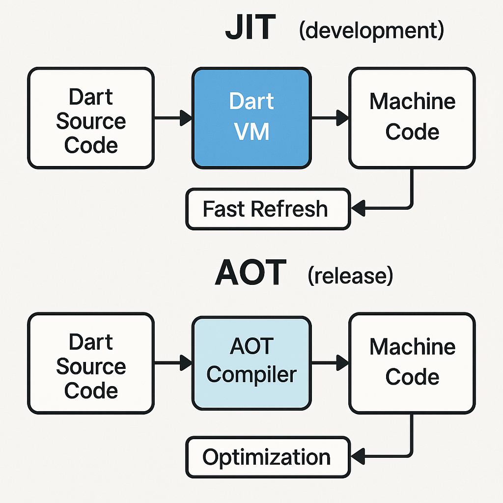
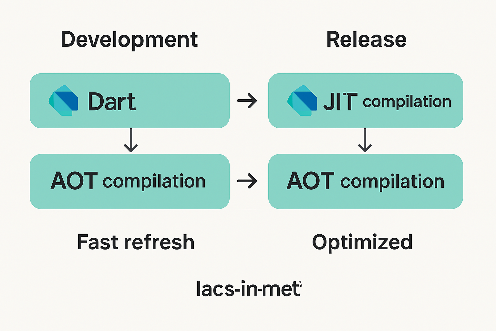
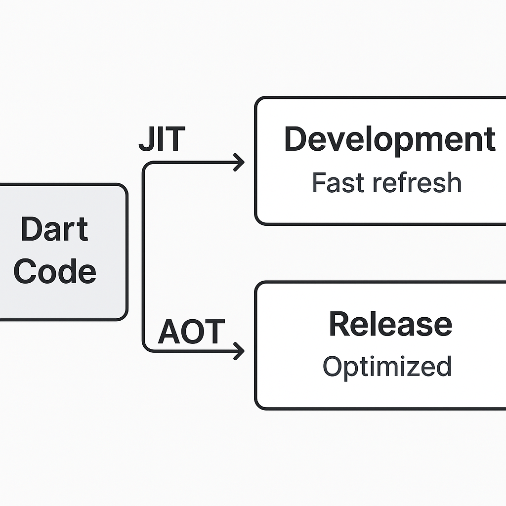

# Kurikulum Komprehensif Dart untuk Persyaratan Masuk Flutter (Fokus _Front-end_)

**Waktu Estimasi Keseluruhan Kurikulum:** 2-4 Minggu (Tergantung kecepatan belajar dan intensitas praktik)

**Level:** Pemula hingga Menengah Awal

**Prasyarat:**

- Tidak ada prasyarat pemrograman formal, namun kemampuan berpikir logis dan pemecahan masalah dasar sangat membantu.
- Kemauan untuk belajar secara mandiri dan berlatih secara konsisten.
- Akses ke komputer dan koneksi internet.

**Alat Esensial:**

- **Flutter SDK:** Meskipun ini adalah kurikulum Dart, Flutter SDK akan menginstal Dart SDK secara otomatis. Flutter SDK juga menyediakan _tooling_ untuk menjalankan kode Dart.
- **Editor Teks/IDE:**
  - **Visual Studio Code (VS Code):** Sangat direkomendasikan karena ringan, gratis, dan memiliki ekstensi Dart/Flutter yang sangat baik.
  - **Android Studio/IntelliJ IDEA:** Pilihan yang lebih berat tetapi menawarkan fitur IDE yang lebih lengkap, terutama jika Anda berencana melanjutkan ke pengembangan Android asli.
- **Browser Web:** Untuk mengakses dokumentasi dan sumber daya _online_.

**Hasil Pembelajaran (Learning Outcomes):**

Setelah menyelesaikan kurikulum ini, peserta akan:

- Memahami konsep dasar bahasa pemrograman Dart, termasuk variabel, tipe data, operator, _control flow_, fungsi, dan konsep dasar _object-oriented programming_ (OOP).
- Mampu menulis kode Dart yang bersih, mudah dibaca, dan efisien untuk membangun logika aplikasi _front-end_ sederhana.
- Memahami bagaimana Dart berinteraksi dengan Flutter untuk membangun antarmuka pengguna yang reaktif.
- Mampu mengidentifikasi dan memecahkan masalah dasar dalam kode Dart.
- Memiliki fondasi yang kuat untuk memulai pembelajaran Flutter.

---

## Fase 1: Dasar-dasar Dart (Foundation)

**Level:** Pemula

**Waktu Estimasi:** 3-5 Hari

### Modul 1.1: Pengantar Dart dan Lingkungan Pengembangan

---

1.  **Deskripsi Konkret:** Modul ini akan memperkenalkan Dart sebagai bahasa pemrograman, menjelaskan mengapa Dart dipilih untuk Flutter, dan memandu Anda dalam menyiapkan lingkungan pengembangan yang diperlukan untuk mulai menulis dan menjalankan kode Dart.
2.  **Konsep Dasar dan Filosofi:**
    - **Dart:** Bahasa pemrograman _client-optimized_ yang dikembangkan oleh Google, dirancang untuk membangun aplikasi _mobile_, _desktop_, _web_, dan _backend_.
    - **Fokus Client-Optimized:** Dart dirancang untuk _fast development_ dan _high performance_ pada semua platform, membuatnya ideal untuk _front-end_.
    - **Just-In-Time (JIT) Compilation:** Digunakan selama pengembangan untuk _fast refresh_ UI.
    - **Ahead-Of-Time (AOT) Compilation:** Digunakan saat _release_ aplikasi untuk performa yang optimal.
    - **Multi-Platform:** Dart dapat berjalan di berbagai platform melalui Flutter.
3.  **Sintaks Dasar/Contoh Implementasi Inti:**
    - **Contoh Program "Hello, World\!":**
      ```dart
      void main() {
        print('Hello, World!');
      }
      ```
    - **Menjalankan Kode Dart:** Penjelasan tentang bagaimana menggunakan terminal (`dart run <nama_file.dart>`) atau fitur _run_ di IDE.
    - **Komentar dalam Dart:**
      ```dart
      // Ini adalah komentar satu baris
      /* Ini adalah komentar
         multi-baris */
      /// Ini adalah komentar dokumentasi
      ```
4.  **Terminologi Kunci:**
    - **Dart SDK:** _Software Development Kit_ untuk Dart, berisi _tool_ yang diperlukan untuk mengembangkan aplikasi Dart.
    - **IDE (Integrated Development Environment):** Lingkungan pengembangan perangkat lunak yang menyediakan fasilitas komprehensif untuk pengembang, seperti editor kode, _debugger_, dan _compiler_. Contoh: VS Code, Android Studio.
    - **Flutter SDK:** _Software Development Kit_ untuk Flutter, sebuah _framework_ UI yang menggunakan Dart.
    - **`main()` function:** Titik masuk utama eksekusi program Dart.
    - **`print()` function:** Fungsi bawaan Dart untuk mencetak output ke konsol.
    - **Komentar:** Bagian kode yang diabaikan oleh _compiler_, digunakan untuk menjelaskan kode.
5.  **Daftar Isi (Table of Contents):**
    - Apa itu Dart dan Mengapa Penting untuk Flutter?
    - Sejarah Singkat Dart.
    - Fitur Utama Dart: JIT, AOT, Null Safety.
    - Memasang Flutter SDK (Otomatis Menginstal Dart SDK).
    - Menyiapkan Lingkungan Pengembangan (VS Code/Android Studio).
    - Program Dart Pertama: "Hello, World\!".
    - Cara Menjalankan Kode Dart.
    - Penggunaan Komentar dalam Kode.
6.  **Sumber Referensi:**
    - [Dart Official Website](https://dart.dev/)
    - [Flutter Official Website](https://flutter.dev/)
    - [Get the Dart SDK](https://dart.dev/get-dart)
    - [Install Flutter](https://flutter.dev/docs/get-started/install)
    - [Visual Studio Code - Dart Extension](https://marketplace.visualstudio.com/items?itemName=Dart-Code.dart-code)
7.  **Visualisasi:** Gambar visual direkomendasikan di sini untuk menjelaskan alur kerja Dart JIT vs AOT Compilation.



### Modul 1.1 – Alur Kerja Dart: JIT vs AOT

• Dua jalur paralel:

1. “Development” menggunakan _Just-In-Time_ (JIT) → panah menunjuk ke kotak “Fast Refresh / Hot Reload” → loop kembali ke kode.
2. “Release” menggunakan _Ahead-Of-Time_ (AOT) → panah menunjuk ke kotak “Optimized Native Binary” → ke ikon perangkat.  
   • Di bawah tiap jalur dicantumkan trade-off: kecepatan build vs performa runtime.

---

### Modul 1.2: Variabel dan Tipe Data

1.  **Deskripsi Konkret:** Modul ini akan membahas bagaimana menyimpan informasi dalam program menggunakan variabel dan berbagai jenis data yang dapat disimpan oleh Dart.
2.  **Konsep Dasar dan Filosofi:**
    - **Variabel:** Wadah bernama untuk menyimpan nilai yang dapat berubah selama eksekusi program.
    - **Tipe Data:** Mengklasifikasikan jenis nilai yang dapat disimpan dalam variabel, memungkinkan _compiler_ untuk memahami bagaimana nilai tersebut harus ditangani dan mencegah kesalahan. Dart adalah bahasa yang _strongly typed_ (tipe datanya jelas), tetapi juga memiliki _type inference_ (dapat menebak tipe data).
    - **Null Safety:** Fitur penting di Dart yang membantu mencegah kesalahan _runtime_ yang disebabkan oleh nilai `null` yang tidak terduga. Ini memaksa pengembang untuk secara eksplisit menangani kasus di mana variabel mungkin tidak memiliki nilai.
3.  **Sintaks Dasar/Contoh Implementasi Inti:**

    - **Deklarasi Variabel:**
      ```dart
      String nama = 'Alice';
      int usia = 30;
      double tinggi = 175.5;
      bool isStudent = true;
      ```
    - **`var` dan `dynamic`:**

      ```dart
      var pesan = 'Halo Dunia'; // Tipe inference: String
      // pesan = 123; // Error: Tipe tidak cocok

      dynamic nilaiApaSaja = 'Dart'; // Tipe dinamis
      nilaiApaSaja = 123; // Diizinkan
      ```

    - **Konstanta (`final` dan `const`):**

      ```dart
      final String namaDepan = 'Budi'; // Nilai hanya bisa diinisialisasi sekali
      // namaDepan = 'Andi'; // Error

      const double PI = 3.14; // Nilai harus diketahui saat kompilasi
      // PI = 3.14159; // Error
      ```

    - **Null Safety Contoh:**
      ```dart
      String? namaBelakang; // Variabel bisa null
      String namaLengkap = 'John Doe';
      // String namaLengkapTanpaNull = namaBelakang; // Error tanpa penanganan null
      ```

4.  **Terminologi Kunci:**
    - **Variabel:** Penyimpan data sementara.
    - **Tipe Data:** Klasifikasi data (misalnya, teks, angka, boolean).
    - **Integer (`int`):** Bilangan bulat.
    - **Double (`double`):** Bilangan desimal.
    - **String (`String`):** Urutan karakter (teks).
    - **Boolean (`bool`):** Nilai kebenaran ( `true` atau `false`).
    - **`var`:** Kata kunci untuk deklarasi variabel dengan _type inference_.
    - **`dynamic`:** Kata kunci untuk variabel yang tipenya dapat berubah saat _runtime_.
    - **`final`:** Kata kunci untuk variabel yang nilainya tidak dapat diubah setelah diinisialisasi.
    - **`const`:** Kata kunci untuk variabel yang nilainya adalah konstanta waktu kompilasi.
    - **Null Safety:** Sistem untuk mencegah kesalahan yang disebabkan oleh nilai `null`.
    - **Nullable Type:** Tipe data yang bisa memiliki nilai `null` (ditandai dengan `?`).
    - **Non-nullable Type:** Tipe data yang tidak bisa memiliki nilai `null`.
5.  **Daftar Isi (Table of Contents):**
    - Apa itu Variabel?
    - Deklarasi dan Inisialisasi Variabel.
    - Tipe Data Dasar Dart: `int`, `double`, `String`, `bool`.
    - Penggunaan `var` untuk _Type Inference_.
    - Kapan Menggunakan `dynamic`?
    - Konstanta: `final` vs `const`.
    - Memahami Null Safety di Dart.
    - Mendeklarasikan Tipe _Nullable_ dan _Non-nullable_.
6.  **Sumber Referensi:**
    - [Built-in types - Dart documentation](https://www.google.com/search?q=https://dart.dev/guides/language/language-tour%23built-in-types)
    - [Variables - Dart documentation](https://www.google.com/search?q=https://dart.dev/guides/language/language-tour%23variables)
    - [Sound null safety - Dart documentation](https://www.google.com/search?q=https://dart.dev/guides/language/effective-dart/usage%23avoid-non-nullable-types-for-parameters)
7.  **Visualisasi:** Di sini untuk menjelaskan perbedaan `final` dan `const` serta bagaimana Null Safety bekerja dengan contoh visual dari variabel yang bisa `null` dan tidak.



### Modul 1.2 – `final` vs `const` & Nullable vs Non-nullable

• Dua kolom berdampingan:

- Kolom `final`: menampilkan wadah variabel yang bisa diisi sekali pada runtime.
- Kolom `const`: menampilkan wadah yang diisi saat compile-time.  
  • Di bawahnya diagram tipe dengan dua cabang:
- Non-nullable (`String`) → panah ke variabel yang selalu berisi nilai.
- Nullable (`String?`) → panah ke variabel yang bisa menunjuk “null” (digambarkan wadah kosong).

---

### Modul 1.3: Operator dan Ekspresi

1.  **Deskripsi Konkret:** Modul ini akan mengajarkan bagaimana melakukan operasi matematika, perbandingan, dan logika menggunakan operator di Dart. Anda akan belajar bagaimana menggabungkan operator untuk membuat ekspresi yang menghasilkan nilai.
2.  **Konsep Dasar dan Filosofi:**
    - **Operator:** Simbol yang melakukan operasi pada satu atau lebih nilai (operan).
    - **Ekspresi:** Kombinasi operan dan operator yang mengevaluasi ke satu nilai.
    - **Prioritas Operator:** Aturan yang menentukan urutan evaluasi operator dalam ekspresi kompleks.
3.  **Sintaks Dasar/Contoh Implementasi Inti:**
    - **Operator Aritmetika:** `+`, `-`, `*`, `/`, `%` (modulo), `~/` (integer division).
      ```dart
      int a = 10;
      int b = 3;
      print(a + b); // 13
      print(a / b); // 3.333...
      print(a ~/ b); // 3 (pembagian bulat)
      ```
    - **Operator Perbandingan:** `==`, `!=`, `<`, `>`, `<=`, `>=`.
      ```dart
      print(a == b); // false
      print(a > b);  // true
      ```
    - **Operator Logika:** `&&` (AND), `||` (OR), `!` (NOT).
      ```dart
      bool isRaining = true;
      bool hasUmbrella = false;
      print(isRaining && hasUmbrella); // false
      print(isRaining || hasUmbrella); // true
      print(!isRaining);               // false
      ```
    - **Operator Penugasan:** `=`, `+=`, `-=`, `*=`, `/=`, `%=`.
      ```dart
      int x = 5;
      x += 3; // x sekarang 8 (x = x + 3)
      ```
    - **Operator _Type Test_:** `is`, `is!`, `as`.
      ```dart
      dynamic data = 10;
      if (data is int) {
        print('Data adalah integer');
      }
      // int angka = data as int; // Casting eksplisit
      ```
4.  **Terminologi Kunci:**
    - **Operator:** Simbol untuk operasi.
    - **Operand:** Nilai yang dioperasikan.
    - **Ekspresi:** Kombinasi operator dan operan.
    - **Aritmetika:** Operasi matematika dasar.
    - **Perbandingan:** Membandingkan nilai (menghasilkan `true`/`false`).
    - **Logika:** Operasi boolean.
    - **Penugasan:** Menetapkan nilai ke variabel.
    - **_Type Test_:** Memeriksa atau mengubah tipe data.
    - **Unary Operator:** Operator dengan satu operan (misalnya, `!`, `-` sebagai negasi).
    - **Binary Operator:** Operator dengan dua operan (misalnya, `+`, `==`).
5.  **Daftar Isi (Table of Contents):**
    - Apa itu Operator dan Ekspresi?
    - Operator Aritmetika.
    - Operator Perbandingan.
    - Operator Logika.
    - Operator Penugasan.
    - Operator _Type Test_ (`is`, `is!`, `as`).
    - Precedensi Operator.
    - Membangun Ekspresi Kompleks.
6.  **Sumber Referensi:**
    - [Operators - Dart documentation](https://www.google.com/search?q=https://dart.dev/guides/language/language-tour%23operators)
7.  **Visualisasi:** Gambar visual direkomendasikan di sini untuk menjelaskan diagram hirarki prioritas operator.



### Modul 1.3 – Hirarki Operator Dart

• Bentuk piramida atau tangga:

1. Level tertinggi: Operator _type test_ (`is`, `as`)
2. Lalu _logical_ (`!`, `&&`, `||`)
3. _comparison_ (`==`, `<`, `>=`, …)
4. _arithmetic_ (`+`, `-`, `*`, `/`, …)
5. Dasar: _assignment_ (`=`, `+=`, …)  
   • Setiap level diberi warna berbeda dan contoh kecil di samping.

---

### Modul 1.4: Kontrol Alur (Control Flow)

1.  **Deskripsi Konkret:** Modul ini akan mengajarkan cara mengontrol alur eksekusi program berdasarkan kondisi atau untuk mengulang blok kode. Ini adalah fundamental untuk membuat program yang interaktif dan dinamis.
2.  **Konsep Dasar dan Filosofi:**
    - **Kontrol Alur:** Mekanisme yang memungkinkan program untuk membuat keputusan (percabangan) atau mengulang serangkaian instruksi (perulangan).
    - **Percabangan (Conditional Statements):** Menjalankan blok kode tertentu hanya jika kondisi tertentu terpenuhi.
    - **Perulangan (Loops):** Mengulang eksekusi blok kode beberapa kali sampai kondisi tertentu terpenuhi atau sampai semua item dalam koleksi telah diproses.
3.  **Sintaks Dasar/Contoh Implementasi Inti:**
    - **`if`, `else if`, `else`:**
      ```dart
      int nilai = 75;
      if (nilai >= 90) {
        print('Nilai A');
      } else if (nilai >= 70) {
        print('Nilai B');
      } else {
        print('Nilai C');
      }
      ```
    - **`switch` (dengan `case` dan `break`):**
      ```dart
      String cuaca = 'cerah';
      switch (cuaca) {
        case 'cerah':
          print('Bagus untuk jalan-jalan!');
          break;
        case 'hujan':
          print('Jangan lupa payung!');
          break;
        default:
          print('Tidak yakin cuaca apa.');
      }
      ```
    - **`for` loop:**
      ```dart
      for (int i = 0; i < 5; i++) {
        print('Iterasi ke-$i');
      }
      ```
    - **`for-in` loop (untuk koleksi):**
      ```dart
      List<String> buah = ['apel', 'pisang', 'mangga'];
      for (String itemBuah in buah) {
        print(itemBuah);
      }
      ```
    - **`while` loop:**
      ```dart
      int hitung = 0;
      while (hitung < 3) {
        print('Hitungan: $hitung');
        hitung++;
      }
      ```
    - **`do-while` loop:**
      ```dart
      int i = 0;
      do {
        print('Ini akan dijalankan setidaknya sekali');
        i++;
      } while (i < 0);
      ```
    - **`break` dan `continue`:**
      ```dart
      for (int j = 0; j < 10; j++) {
        if (j == 3) {
          continue; // Lewati iterasi ini
        }
        if (j == 7) {
          break; // Hentikan loop
        }
        print(j);
      }
      ```
4.  **Terminologi Kunci:**
    - **Kontrol Alur:** Mekanisme pengambilan keputusan dan perulangan.
    - **Percabangan (Conditional):** Pemilihan blok kode berdasarkan kondisi (`if`, `else`, `switch`).
    - **Perulangan (Loop):** Pengulangan blok kode (`for`, `while`, `do-while`).
    - **Kondisi (Condition):** Ekspresi boolean yang menentukan alur program.
    - **`break`:** Menghentikan perulangan atau `switch` secara paksa.
    - **`continue`:** Melanjutkan ke iterasi berikutnya dalam perulangan.
5.  **Daftar Isi (Table of Contents):**
    - Pengenalan Kontrol Alur.
    - Pernyataan `if`, `else if`, `else`.
    - Pernyataan `switch` dan `case`.
    - Loop `for`.
    - Loop `for-in` untuk Iterasi Koleksi.
    - Loop `while`.
    - Loop `do-while`.
    - Menggunakan `break` dan `continue`.
6.  **Sumber Referensi:**
    - [Control flow statements - Dart documentation](https://www.google.com/search?q=https://dart.dev/guides/language/language-tour%23control-flow-statements)
7.  **Visualisasi:** Gambar visual direkomendasikan di sini untuk menjelaskan diagram alur dari `if-else` dan loop `for`/`while`.

### Modul 1.5: Fungsi (Functions)

---

1.  **Deskripsi Konkret:** Modul ini akan memperkenalkan konsep fungsi, blok kode yang dapat digunakan kembali untuk melakukan tugas tertentu. Anda akan belajar cara membuat, memanggil, dan memberikan parameter pada fungsi.
2.  **Konsep Dasar dan Filosofi:**
    - **Fungsi:** Sebuah blok kode yang diorganisir, dapat digunakan kembali, dan dirancang untuk melakukan tugas tunggal atau serangkaian tugas yang saling terkait. Fungsi meningkatkan modularitas, keterbacaan, dan _reusability_ kode.
    - **Parameter:** Nilai yang diteruskan ke fungsi saat dipanggil, memungkinkan fungsi untuk beroperasi pada data yang berbeda.
    - **Nilai Kembalian (Return Value):** Nilai yang dihasilkan oleh fungsi setelah menyelesaikan tugasnya.
    - **Fungsi sebagai _First-Class Citizens_:** Di Dart, fungsi dapat diperlakukan seperti variabel: diteruskan sebagai argumen, disimpan dalam variabel, dan dikembalikan dari fungsi lain.
3.  **Sintaks Dasar/Contoh Implementasi Inti:**
    - **Fungsi Sederhana:**
      ```dart
      void sapaPengguna() {
        print('Halo, selamat datang!');
      }
      // Memanggil fungsi
      sapaPengguna();
      ```
    - **Fungsi dengan Parameter Positional:**
      ```dart
      void sapaNama(String nama) {
        print('Halo, $nama!');
      }
      sapaNama('Budi');
      ```
    - **Fungsi dengan Nilai Kembalian:**
      ```dart
      int tambah(int a, int b) {
        return a + b;
      }
      int hasil = tambah(5, 3); // hasil = 8
      print(hasil);
      ```
    - **Fungsi dengan Parameter Bernama (Named Parameters):**
      ```dart
      void cetakDetail({String? nama, int? usia}) {
        print('Nama: $nama, Usia: $usia');
      }
      cetakDetail(nama: 'Citra', usia: 25);
      cetakDetail(usia: 30); // nama akan null
      ```
    - **Parameter Wajib (`required`):**
      ```dart
      void daftarPengguna({required String email, required String password}) {
        print('Email: $email, Password: $password');
      }
      daftarPengguna(email: 'user@example.com', password: 'secure_password');
      ```
    - **Fungsi Panah (Arrow Functions):** Untuk fungsi satu baris.
      ```dart
      int kaliDua(int angka) => angka * 2;
      print(kaliDua(7)); // 14
      ```
4.  **Terminologi Kunci:**
    - **Fungsi:** Blok kode yang dapat digunakan kembali.
    - **Pemanggilan Fungsi:** Proses menjalankan fungsi.
    - **Parameter/Argumen:** Data yang diteruskan ke fungsi.
    - **Nilai Kembalian (Return Value):** Hasil dari fungsi.
    - **`void`:** Menunjukkan fungsi tidak mengembalikan nilai.
    - **Parameter Positional:** Parameter yang urutannya penting.
    - **Parameter Bernama (Named Parameters):** Parameter yang diidentifikasi berdasarkan nama.
    - **`required`:** Kata kunci untuk parameter bernama yang wajib diisi.
    - **Fungsi Panah (Arrow Function):** Sintaks singkat untuk fungsi satu ekspresi.
5.  **Daftar Isi (Table of Contents):**
    - Pengenalan Fungsi: Apa dan Mengapa?
    - Mendeklarasikan dan Memanggil Fungsi Sederhana.
    - Fungsi dengan Parameter.
    - Fungsi dengan Nilai Kembalian.
    - Jenis Parameter: Positional, Bernama (Named).
    - Menggunakan `required` untuk Parameter Bernama.
    - Fungsi Panah (Arrow Functions) untuk Kode Singkat.
    - Fungsi sebagai Objek _First-Class_.
6.  **Sumber Referensi:**
    - [Functions - Dart documentation](https://www.google.com/search?q=https://dart.dev/guides/language/language-tour%23functions)
7.  **Visualisasi:** Gambar visual direkomendasikan di sini untuk menjelaskan alur input (parameter) dan output (return value) fungsi.

---

## Fase 2: Struktur Data dan OOP Dasar (Intermediate Foundation)

**Level:** Pemula Menengah

**Waktu Estimasi:** 4-7 Hari

### Modul 2.1: Koleksi (Collections)

---

1.  **Deskripsi Konkret:** Modul ini akan membahas struktur data dasar di Dart yang digunakan untuk menyimpan kumpulan data, seperti daftar (list), set, dan peta (map). Ini sangat penting untuk mengelola data dalam aplikasi _front-end_.
2.  **Konsep Dasar dan Filosofi:**
    - **Koleksi:** Struktur data yang dirancang untuk menyimpan dan mengelola banyak item data.
    - **List:** Koleksi terurut yang memungkinkan duplikasi item dan akses berdasarkan indeks. Mirip dengan array di bahasa lain.
    - **Set:** Koleksi tidak terurut yang hanya menyimpan item unik. Berguna untuk menghilangkan duplikasi.
    - **Map:** Koleksi pasangan kunci-nilai (key-value pairs), di mana setiap kunci unik memetakan ke sebuah nilai. Berguna untuk menyimpan data terstruktur.
3.  **Sintaks Dasar/Contoh Implementasi Inti:**
    - **List:**
      ```dart
      List<String> daftarBuah = ['apel', 'pisang', 'jeruk'];
      print(daftarBuah[0]); // apel
      daftarBuah.add('mangga');
      print(daftarBuah.length); // 4
      daftarBuah.remove('pisang');
      ```
    - **Set:**
      ```dart
      Set<int> angkaUnik = {1, 2, 3, 2, 1}; // {1, 2, 3}
      angkaUnik.add(4);
      print(angkaUnik.contains(2)); // true
      ```
    - **Map:**
      ```dart
      Map<String, String> dataPengguna = {
        'nama': 'John Doe',
        'email': 'john.doe@example.com'
      };
      print(dataPengguna['nama']); // John Doe
      dataPengguna['usia'] = '30';
      print(dataPengguna.keys);
      print(dataPengguna.values);
      ```
    - **Iterasi Koleksi:**
      ```dart
      for (var buah in daftarBuah) {
        print(buah);
      }
      daftarBuah.forEach((buah) => print(buah));
      ```
4.  **Terminologi Kunci:**
    - **List:** Koleksi terurut, indeks berbasis nol.
    - **Set:** Koleksi tidak terurut, item unik.
    - **Map:** Koleksi kunci-nilai.
    - **Indeks:** Posisi item dalam List.
    - **Kunci (Key):** Pengenal unik dalam Map.
    - **Nilai (Value):** Data yang terkait dengan kunci dalam Map.
    - **Literals:** Cara singkat untuk membuat koleksi (misalnya `[]` untuk list, `{}` untuk set/map).
    - **`add()`, `remove()`, `contains()`, `length`:** Metode umum koleksi.
5.  **Daftar Isi (Table of Contents):**
    - Pengenalan Koleksi di Dart.
    - List: Membuat, Mengakses, Memanipulasi.
    - Set: Membuat, Menambahkan, Memeriksa Keunikan.
    - Map: Membuat, Mengakses dengan Kunci, Menambahkan Pasangan Kunci-Nilai.
    - Iterasi Melalui Koleksi (`for-in`, `forEach`).
    - Contoh Penggunaan Nyata Koleksi dalam Aplikasi _Front-end_.
6.  **Sumber Referensi:**
    - [Lists - Dart documentation](https://www.google.com/search?q=https://dart.dev/guides/language/language-tour%23lists)
    - [Sets - Dart documentation](https://www.google.com/search?q=https://dart.dev/guides/language/language-tour%23sets)
    - [Maps - Dart documentation](https://www.google.com/search?q=https://dart.dev/guides/language/language-tour%23maps)
7.  **Visualisasi:** Gambar visual direkomendasikan di sini untuk membedakan antara struktur data List, Set, dan Map secara visual.

### Modul 2.2: Pemrograman Berorientasi Objek (OOP) Bagian 1: Kelas & Objek

---

1.  **Deskripsi Konkret:** Modul ini akan memperkenalkan dasar-dasar Pemrograman Berorientasi Objek (OOP) di Dart, dimulai dengan konsep kelas dan objek. Ini adalah paradigma kunci yang digunakan Flutter untuk membangun UI.
2.  **Konsep Dasar dan Filosofi:**
    - **OOP (Object-Oriented Programming):** Paradigma pemrograman yang mengatur desain perangkat lunak di sekitar objek dan data, daripada fungsi dan logika. Tujuan utamanya adalah modularitas dan _reusability_.
    - **Kelas (Class):** Sebuah _blueprint_ atau cetak biru untuk membuat objek. Mendefinisikan properti (data) dan metode (perilaku) yang akan dimiliki oleh objek.
    - **Objek (Object/Instance):** Implementasi nyata dari sebuah kelas. Setiap objek memiliki nilai propertinya sendiri.
    - **Properti/Atribut (Properties/Attributes):** Variabel yang menyimpan data dalam sebuah objek.
    - **Metode (Methods):** Fungsi yang terkait dengan objek, mendefinisikan perilaku objek.
    - **Enkapsulasi (Encapsulation):** Pembatasan akses langsung ke beberapa komponen objek, menyembunyikan detail implementasi internal dan mengekspos hanya antarmuka yang diperlukan.
3.  **Sintaks Dasar/Contoh Implementasi Inti:**

    - **Deklarasi Kelas:**

      ```dart
      class Kucing {
        // Properti (Variabel Instan)
        String nama;
        String warnaBulu;

        // Konstruktor (untuk membuat objek)
        Kucing(this.nama, this.warnaBulu);

        // Metode
        void meong() {
          print('$nama berkata: Meong!');
        }

        void tidur() {
          print('$nama sedang tidur.');
        }
      }
      ```

    - **Membuat Objek (Instansiasi):**
      ```dart
      Kucing kiki = Kucing('Kiki', 'Oranye');
      Kucing miko = Kucing('Miko', 'Hitam');
      ```
    - **Mengakses Properti dan Memanggil Metode:**
      ```dart
      print(kiki.nama);       // Kiki
      kiki.meong();           // Kiki berkata: Meong!
      miko.tidur();           // Miko sedang tidur.
      ```
    - **Konstruktor Bernama (Named Constructors):**
      ```dart
      class Point {
        double x, y;
        Point(this.x, this.y);
        Point.origin() : x = 0.0, y = 0.0; // Named constructor
      }
      Point p1 = Point(10.0, 20.0);
      Point p2 = Point.origin();
      ```
    - **`this` Keyword:** Mereferensikan objek saat ini.

4.  **Terminologi Kunci:**
    - **OOP:** Paradigma pemrograman berorientasi objek.
    - **Kelas:** Cetak biru untuk objek.
    - **Objek/Instans:** Realisasi dari kelas.
    - **Properti/Atribut:** Data dalam objek.
    - **Metode:** Perilaku objek.
    - **Konstruktor:** Metode khusus untuk membuat objek.
    - **Instansiasi:** Proses membuat objek dari kelas.
    - **Enkapsulasi:** Menyembunyikan detail internal.
    - **`this`:** Kata kunci untuk objek saat ini.
    - **Named Constructor:** Konstruktor tambahan dengan nama spesifik.
5.  **Daftar Isi (Table of Contents):**
    - Pengantar OOP: Mengapa Penting untuk Flutter?
    - Konsep Kelas dan Objek.
    - Mendefinisikan Properti dan Metode dalam Kelas.
    - Membuat Objek (Instansiasi Kelas).
    - Mengakses Properti dan Memanggil Metode.
    - Konstruktor Dasar.
    - Konstruktor Bernama (Named Constructors).
    - Penggunaan Kata Kunci `this`.
    - Prinsip Enkapsulasi Dasar.
6.  **Sumber Referensi:**
    - [Classes - Dart documentation](https://www.google.com/search?q=https://dart.dev/guides/language/language-tour%23classes)
    - [Constructors - Dart documentation](https://www.google.com/search?q=https://dart.dev/guides/language/language-tour%23constructors)
7.  **Visualisasi:** Gambar visual direkomendasikan di sini untuk menjelaskan analogi _blueprint_ (kelas) dan bangunan nyata (objek) untuk memahami OOP.

### Modul 2.3: Pemrograman Berorientasi Objek (OOP) Bagian 2: Pewarisan, Polimorfisme, Abstraksi

---

1.  **Deskripsi Konkret:** Modul lanjutan ini akan menyelami konsep-konsep OOP yang lebih canggih seperti pewarisan, polimorfisme, dan abstraksi, yang sangat mendasar dalam merancang aplikasi skala besar, termasuk aplikasi Flutter.
2.  **Konsep Dasar dan Filosofi:**
    - **Pewarisan (Inheritance):** Mekanisme di mana sebuah kelas (kelas anak/subkelas) dapat mewarisi properti dan metode dari kelas lain (kelas induk/superkelas), mempromosikan _code reusability_ dan hirarki kelas.
    - **Polimorfisme (Polymorphism):** Kemampuan objek dari kelas yang berbeda untuk merespons metode dengan nama yang sama dengan cara yang berbeda. Ini berarti sebuah objek dapat mengambil banyak bentuk, memungkinkan kode yang lebih fleksibel dan umum.
    - **Abstraksi (Abstraction):** Menyembunyikan detail implementasi yang kompleks dan hanya menampilkan fungsionalitas penting kepada pengguna. Di Dart, ini sering dicapai dengan _abstract classes_ dan _interfaces_.
    - **Antarmuka (Interfaces):** Sebuah kontrak yang mendefinisikan sekumpulan metode yang harus diimplementasikan oleh kelas yang mengimplementasikannya. Di Dart, setiap kelas secara implisit mendefinisikan *interface*nya.
3.  **Sintaks Dasar/Contoh Implementasi Inti:**

    - **Pewarisan (`extends`):**

      ```dart
      class Hewan {
        String nama;
        Hewan(this.nama);
        void makan() {
          print('$nama sedang makan.');
        }
      }

      class Anjing extends Hewan { // Anjing mewarisi dari Hewan
        String jenis;
        Anjing(String nama, this.jenis) : super(nama); // Memanggil konstruktor induk
        void gonggong() {
          print('$nama (${jenis}) berkata: Guk guk!');
        }
      }

      Anjing doggy = Anjing('Doggy', 'Golden');
      doggy.makan();   // Doggy sedang makan. (metode dari Hewan)
      doggy.gonggong(); // Doggy (Golden) berkata: Guk guk!
      ```

    - **Polimorfisme:**
      ```dart
      Hewan peliharaan = Anjing('Buddy', 'Poodle'); // Objek Anjing diperlakukan sebagai Hewan
      peliharaan.makan(); // Buddy sedang makan.
      // peliharaan.gonggong(); // Error: gonggong() tidak ada di Hewan
      ```
    - **`@override` Annotation:** Menunjukkan bahwa sebuah metode di kelas anak menimpa metode di kelas induk.
      ```dart
      class Kucing extends Hewan {
        Kucing(String nama) : super(nama);
        @override
        void makan() {
          print('$nama makan ikan.'); // Perilaku berbeda
        }
      }
      ```
    - **Kelas Abstrak (`abstract class`):**

      ```dart
      abstract class Bentuk {
        void gambar(); // Metode abstrak (tidak punya implementasi)
        void getLuas() {
          print('Menghitung luas...'); // Metode dengan implementasi
        }
      }

      class Lingkaran extends Bentuk {
        @override
        void gambar() {
          print('Menggambar lingkaran.');
        }
      }

      // Bentuk bentuk1 = Bentuk(); // Error: Tidak bisa membuat objek dari kelas abstrak
      Lingkaran lingkaran1 = Lingkaran();
      lingkaran1.gambar();
      ```

    - **Antarmuka (Implicit Interfaces - `implements`):**

      ```dart
      class Kendaraan {
        void maju() { print('Kendaraan maju.'); }
      }

      class Mobil implements Kendaraan { // Mobil mengimplementasikan antarmuka Kendaraan
        @override
        void maju() {
          print('Mobil bergerak maju.');
        }
        void klakson() {
          print('Beep beep!');
        }
      }
      Mobil myCar = Mobil();
      myCar.maju();
      ```

4.  **Terminologi Kunci:**
    - **Pewarisan (Inheritance):** Mendapatkan properti/metode dari kelas lain.
    - **Kelas Induk/Superkelas:** Kelas yang diwarisi.
    - **Kelas Anak/Subkelas:** Kelas yang mewarisi.
    - **`extends`:** Kata kunci untuk pewarisan.
    - **`super`:** Kata kunci untuk mengakses anggota kelas induk.
    - **Polimorfisme:** Objek dapat mengambil banyak bentuk.
    - **`@override`:** Anotasi untuk menandai penimpaan metode.
    - **Abstraksi:** Menyembunyikan detail, hanya menampilkan esensi.
    - **Kelas Abstrak (`abstract class`):** Kelas yang tidak dapat diinstansiasi langsung, dapat memiliki metode abstrak.
    - **Metode Abstrak:** Metode tanpa implementasi, harus diimplementasikan oleh subkelas non-abstrak.
    - **Antarmuka (Implicit Interface):** Kontrak metode yang harus diimplementasikan.
    - **`implements`:** Kata kunci untuk mengimplementasikan antarmuka.
5.  **Daftar Isi (Table of Contents):**
    - Pengenalan Pewarisan: Konsep dan Manfaat.
    - Sintaks `extends` dan Penggunaan `super`.
    - Memahami Polimorfisme dalam Dart.
    - Penggunaan `@override` Annotation.
    - Konsep Abstraksi dengan `abstract class` dan Metode Abstrak.
    - Antarmuka Implisit di Dart (`implements`).
    - Studi Kasus: Desain Kelas Sederhana Menggunakan OOP.
6.  **Sumber Referensi:**
    - [Extending a class - Dart documentation](https://www.google.com/search?q=https://dart.dev/guides/language/language-tour%23extending-a-class)
    - [Abstract classes - Dart documentation](https://www.google.com/search?q=https://dart.dev/guides/language/language-tour%23abstract-classes)
    - [Implicit interfaces - Dart documentation](https://www.google.com/search?q=https://dart.dev/guides/language/language-tour%23implicit-interfaces)
7.  **Visualisasi:** Gambar visual direkomendasikan di sini untuk menjelaskan hirarki kelas dengan pewarisan, serta perbedaan antara kelas abstrak dan antarmuka.

### Modul 2.4: Penanganan Kesalahan (Error Handling)

---

1.  **Deskripsi Konkret:** Modul ini akan mengajarkan cara mengidentifikasi, mencegah, dan menangani kesalahan (eksepsi) dalam program Dart agar aplikasi tetap berjalan stabil meskipun terjadi kondisi tak terduga.
2.  **Konsep Dasar dan Filosofi:**
    - **Eksepsi (Exception):** Peristiwa yang terjadi selama eksekusi program yang mengganggu alur normal instruksi. Contohnya: mencoba membagi dengan nol, mengakses indeks _list_ di luar batas.
    - **Penanganan Kesalahan:** Proses mengidentifikasi dan merespons eksepsi secara terstruktur untuk mencegah aplikasi _crash_.
    - **`try-catch`:** Blok kode yang digunakan untuk mencoba menjalankan kode yang berpotensi menghasilkan eksepsi dan menangkap eksepsi jika terjadi.
    - **`finally`:** Blok kode yang selalu dijalankan, terlepas dari apakah eksepsi terjadi atau tidak.
    - **`throw`:** Kata kunci untuk secara eksplisit memicu eksepsi.
3.  **Sintaks Dasar/Contoh Implementasi Inti:**
    - **`try-catch` Block:**
      ```dart
      void bagiAngka(int a, int b) {
        try {
          int hasil = a ~/ b; // Berpotensi error jika b = 0
          print('Hasil pembagian: $hasil');
        } catch (e) {
          print('Terjadi kesalahan: $e');
        }
      }
      bagiAngka(10, 2); // Hasil pembagian: 5
      bagiAngka(10, 0); // Terjadi kesalahan: IntegerDivisionByZeroException
      ```
    - **Menangkap Eksepsi Spesifik (`on`):**
      ```dart
      void aksesList(List<int> daftar, int index) {
        try {
          print('Nilai pada indeks $index: ${daftar[index]}');
        } on RangeError {
          print('Error: Indeks di luar batas!');
        } catch (e) {
          print('Kesalahan umum: $e');
        }
      }
      aksesList([1, 2, 3], 1); // Nilai pada indeks 1: 2
      aksesList([1, 2, 3], 5); // Error: Indeks di luar batas!
      ```
    - **`finally` Block:**
      ```dart
      void readFile(String filename) {
        try {
          // Logika membaca file
          print('Membaca file $filename...');
          // throw FormatException('Format file tidak valid!'); // Simulasi error
        } catch (e) {
          print('Error saat membaca file: $e');
        } finally {
          print('Proses pembacaan file selesai (membersihkan sumber daya).');
        }
      }
      readFile('data.txt');
      ```
    - **Melemparkan Eksepsi (`throw`):**
      ```dart
      void validasiUsia(int usia) {
        if (usia < 0) {
          throw ArgumentError('Usia tidak boleh negatif!');
        }
        print('Usia valid: $usia');
      }
      try {
        validasiUsia(-5);
      } catch (e) {
        print('Caught error: $e'); // Caught error: Invalid argument(s): Usia tidak boleh negatif!
      }
      ```
4.  **Terminologi Kunci:**
    - **Eksepsi (Exception):** Peristiwa tak terduga yang mengganggu program.
    - **Penanganan Kesalahan (Error Handling):** Mengelola eksepsi.
    - **`try`:** Blok kode yang diawasi untuk eksepsi.
    - **`catch`:** Menangkap eksepsi.
    - **`on`:** Menangkap eksepsi dari tipe tertentu.
    - **`finally`:** Blok yang selalu dijalankan.
    - **`throw`:** Melemparkan eksepsi secara manual.
    - **Stack Trace:** Urutan panggilan fungsi yang mengarah ke eksepsi.
5.  **Daftar Isi (Table of Contents):**
    - Apa itu Eksepsi dan Mengapa Kita Membutuhkan Penanganan Kesalahan?
    - Blok `try-catch` untuk Penanganan Dasar.
    - Menangkap Eksepsi Spesifik dengan `on`.
    - Penggunaan Blok `finally`.
    - Melemparkan Eksepsi Kustom dengan `throw`.
    - Melihat Stack Trace untuk _Debugging_.
6.  **Sumber Referensi:**
    - [Exceptions - Dart documentation](https://www.google.com/search?q=https://dart.dev/guides/language/language-tour%23exceptions)
7.  **Visualisasi:** Gambar visual direkomendasikan di sini untuk menjelaskan alur `try-catch-finally` menggunakan diagram alir.

---

## Sumber Daya Komunitas & Sertifikasi

- **Komunitas:**
  - [Flutter Community on Reddit](https://www.reddit.com/r/flutterdev/)
  - [Flutter Devs Indonesia (Telegram/Discord)](Cari di Google atau Telegram/Discord untuk grup komunitas lokal)
  - [Stack Overflow (tag `dart` dan `flutter`)](<https://www.google.com/search?q=%5Bhttps://stackoverflow.com/questions/tagged/dart%5D(https://stackoverflow.com/questions/tagged/dart)>)
  - [Medium (cari artikel tentang Dart dan Flutter)](https://medium.com/tag/dart)
- **Sertifikasi:**
  - Saat ini, tidak ada sertifikasi Dart resmi yang berdiri sendiri dari Google. Namun, menguasai Dart adalah prasyarat untuk sertifikasi Flutter.
  - [Google Associate Android Developer Certification](https://www.google.com/search?q=https://developers.google.com/training/certification/android-developer/) (Meskipun ini untuk Android asli, pondasi pengembangan _mobile_ yang baik akan membantu. Belum ada sertifikasi Flutter resmi dari Google, tetapi ini mungkin akan berubah di masa depan).
  - Mencari kursus _online_ di platform seperti Udemy, Coursera, atau edX yang menawarkan sertifikat penyelesaian untuk kursus Dart atau Flutter yang komprehensif.

---

Dengan kurikulum ini, peserta akan memiliki pemahaman yang sangat kuat tentang Dart sebagai fondasi yang kokoh sebelum melangkah lebih jauh ke pengembangan aplikasi _front-end_ dengan Flutter. Setiap modul dirancang untuk membangun pemahaman secara bertahap, dari konsep paling dasar hingga prinsip-prinsip OOP yang lebih kompleks, sambil mempertahankan fokus pada relevansinya dengan pengembangan _front-end_ dan Flutter.
