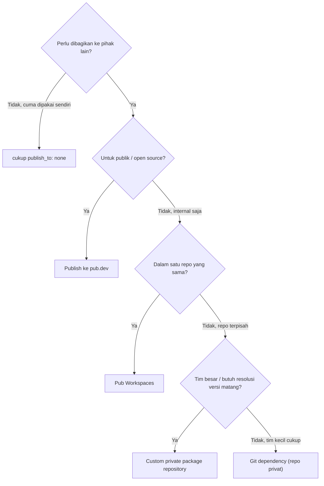

# Panduan Lengkap: Import-Export, pubspec.yaml, dan Package di Dart

> Referensi ini disusun dan di-cross-check terhadap dokumentasi resmi dart.dev per Dart 3.12 (2026). Contoh kode memakai satu package fiktif yang sama dari awal sampai akhir — `konversi_satuan` — supaya kamu bisa melihat bagaimana tiap konsep saling menyambung, bukan potongan lepas-lepas.

---

## 1. Peta Konsep: Empat Istilah yang Sering Tertukar

Sebelum masuk sintaks, samakan dulu mental model-nya. Empat istilah ini berhubungan tapi levelnya beda:

| Istilah | Level | Definisi singkat |
|---|---|---|
| **Library** | Kode | Unit kompilasi & unit privasi terkecil. Default: **1 file `.dart` = 1 library**, walau tidak dideklarasikan eksplisit. |
| **Package** | Folder | Direktori terstruktur berisi satu atau lebih library, ditandai keberadaan `pubspec.yaml`. |
| **pubspec.yaml** | Metadata | "KTP" package: nama, versi, dependency, dan aturan publikasi. |
| **pub** (`dart pub`) | Alat | Package manager yang membaca `pubspec.yaml`, mengunduh dependency, dan mem-publish package. |

Relasinya: **import** menyambungkan satu library ke library lain untuk *dipakai*. **export** menyambungkan satu library ke library lain untuk *diteruskan* sebagai bagian dari API publikmu sendiri. Dua directive ini adalah alat utama untuk mengatur apa yang terlihat dari luar package-mu dan apa yang disembunyikan.

Satu prinsip yang menopang hampir semua keputusan desain di bawah: **privasi di Dart bekerja di level library (file), bukan di level class.** Identifier yang diawali underscore (`_nama`) hanya terlihat di dalam library yang sama. Tidak ada keyword `private`/`public` seperti Java atau C# — Dart sengaja memilih pendekatan ini karena lebih sederhana dan membantu tree-shaking (penghapusan kode mati saat kompilasi).

---

## 2. Import — Sintaks Lengkap

### 2.1 Tiga sumber import

```dart
// 1. Core library bawaan Dart SDK — pakai skema dart:
import 'dart:math';
import 'dart:convert';

// 2. Library dari package (punya sendiri atau punya orang lain) — skema package:
import 'package:test/test.dart';

// 3. File lain dalam package yang sama — path relatif
import 'src/panjang.dart';
```

### 2.2 Aturan relatif vs `package:` (sering salah kaprah)

Ini aturan resmi dari dart.dev, dan sering jadi sumber kebingungan pemula:

- **File pengimpor dan file yang diimpor sama-sama di dalam `lib/`** → pakai **path relatif**.
- **File pengimpor dan file yang diimpor sama-sama di luar `lib/`** (misal sama-sama di `test/`) → pakai **path relatif**.
- **File pengimpor ada di luar `lib/`** (misal di `bin/`, `test/`, `web/`) **tapi yang diimpor ada di dalam `lib/`** → wajib pakai **`package:`**.

Contoh konkret dari `konversi_satuan`:

```dart
// lib/src/panjang.dart mengimpor file lain di dalam lib/ → relatif
import '../konversi_satuan.dart'; // (kalau memang perlu)

// bin/konversi_satuan.dart ada di LUAR lib/, mengimpor isi lib/ → wajib package:
import 'package:konversi_satuan/konversi_satuan.dart';
```

Alasannya masuk akal begitu dipikir: kode di dalam `lib/` harus tetap valid persis sama saat package-mu diinstal sebagai dependency di project orang lain — dan di situ, satu-satunya cara mengaksesnya adalah lewat `package:`.

### 2.3 `show` dan `hide` — mengimpor sebagian

```dart
// Hanya ambil KonversiPanjang, walau file itu mengekspor lebih banyak
import 'package:konversi_satuan/konversi_satuan.dart' show KonversiPanjang;

// Ambil semua KECUALI KonversiBerat
import 'package:konversi_satuan/konversi_satuan.dart' hide KonversiBerat;
```

**Kegunaan:** menghindari polusi namespace dan membuat jelas—baik untuk compiler maupun pembaca kode—simbol mana saja yang benar-benar dipakai di file itu.

### 2.4 Prefix (`as`) — mengatasi tabrakan nama

```dart
import 'package:konversi_satuan/konversi_satuan.dart';
import 'package:paket_lain/paket_lain.dart' as lain;

void main() {
  KonversiSuhu.celsiusKeFahrenheit(100); // dari konversi_satuan, tanpa prefix
  lain.KonversiSuhu.convert(100);        // dari paket_lain, dengan prefix
}
```

**Kegunaan:** dua library punya class/fungsi dengan nama sama persis. Tanpa prefix, compiler tidak tahu mana yang kamu maksud.

### 2.5 Deferred loading — memuat library saat dibutuhkan saja

```dart
// main.dart — aplikasi web yang memakai konversi_satuan
import 'package:konversi_satuan/konversi_satuan.dart' deferred as konversi;

Future<void> saatTombolDiklik() async {
  await konversi.loadLibrary();
  print(konversi.KonversiSuhu.celsiusKeFahrenheit(37));
}
```

**Kegunaan:** mengurangi ukuran bundle awal aplikasi web dengan memuat sebagian kode hanya saat dipakai (lazy-loading). Catatan penting: `dart` tool **tidak mendukung deferred loading di luar target web** — kalau kamu bikin aplikasi Flutter, mekanismenya beda lagi (lihat dokumentasi *deferred components* Flutter).

### 2.6 Conditional import — kode yang beda per platform

Berguna kalau package-mu harus jalan di banyak platform (command-line, web) tapi implementasinya beda dari sisi library sistem yang tersedia.

```dart
// lib/src/penyimpan_stub.dart — fallback default
class PenyimpanLog {
  void simpan(String pesan) => throw UnsupportedError('Platform tidak didukung');
}
```

```dart
// lib/src/penyimpan_io.dart — implementasi command-line / server
import 'dart:io';

class PenyimpanLog {
  void simpan(String pesan) => stderr.writeln(pesan);
}
```
```dart // lib/penyimpan.dart — memilih implementasi sesuai platform yang tersedia import 'src/penyimpan_stub.dart'
    if (dart.library.io) 'src/penyimpan_io.dart'
    if (dart.library.js_interop) 'src/penyimpan_web.dart';
```

`dart.library.io` bernilai `"true"` di lingkungan kompilasi kalau `dart:io` **tersedia untuk dipakai** di platform target (bukan berarti sedang dipakai). Semua implementasi kondisional wajib punya API yang identik, karena kode pemanggil tidak tahu implementasi mana yang sebenarnya aktif.

### 2.7 Ringkasan kapan pakai yang mana

| Kebutuhan | Sintaks |
|---|---|
| Pakai library standar Dart | `import 'dart:nama';` |
| Pakai package lain (termasuk milikmu sendiri, dari luar `lib/`) | `import 'package:nama_package/file.dart';` |
| Pakai file lain dalam `lib/` yang sama | `import 'relative/path.dart';` |
| Cegah tabrakan nama | `... as prefix;` |
| Batasi apa yang masuk | `... show A, B;` / `... hide C;` |
| Lazy-load (web) | `... deferred as prefix;` lalu `prefix.loadLibrary()` |
| Beda implementasi per platform | `import 'stub.dart' if (dart.library.xxx) 'impl.dart';` |

---

## 3. Export — Sintaks Lengkap

### 3.1 Konsep dasar

Kalau `import` adalah "aku mau pakai", `export` adalah **"aku mau meneruskan ini seolah-olah bagian dari punyaku."** Ini adalah mekanisme utama untuk menyusun API publik sebuah package.

```dart
export 'src/panjang.dart';
export 'src/berat.dart' show KonversiBerat;   // hanya teruskan simbol tertentu
export 'src/suhu.dart' hide KonversiSuhuInternal;
```

### 3.2 Pola "barrel file" — pola paling penting dalam package Dart

Rekomendasi resmi dari tim Dart: **jangan tulis satu file besar.** Sebaliknya, pecah jadi *mini library* — idealnya satu class per file — lalu satukan lewat satu "barrel file" yang mengekspor semuanya. Ini pola yang dipakai package-package resmi seperti `shelf`.

Struktur `konversi_satuan`:

```
lib/
├── konversi_satuan.dart      ← barrel file (API publik)
└── src/
    ├── panjang.dart          ← mini library
    ├── berat.dart            ← mini library
    └── suhu.dart             ← mini library
```

```dart
// lib/src/panjang.dart
/// Konversi satuan panjang antar sistem metrik dan imperial.
class KonversiPanjang {
  static double meterKeKaki(double nilai) => nilai * _faktorMeterKeKaki;
  static double kilometerKeMil(double nilai) => nilai * _faktorKmKeMil;

  // Diawali underscore → privat, hanya terlihat di dalam file ini.
  static const double _faktorMeterKeKaki = 3.28084;
  static const double _faktorKmKeMil = 0.621371;
}
```

```dart
// lib/src/berat.dart
class KonversiBerat {
  static double kilogramKePon(double nilai) => nilai * _faktorKgKePon;
  static const double _faktorKgKePon = 2.20462;
}
```

```dart
// lib/src/suhu.dart
class KonversiSuhu {
  static double celsiusKeFahrenheit(double c) => c * 9 / 5 + 32;
  static double celsiusKeKelvin(double c) => c + 273.15;
}
```

```dart
// lib/konversi_satuan.dart — barrel file
/// Pustaka konversi satuan panjang, berat, dan suhu.
///
/// Import file ini untuk mendapatkan seluruh API publik package.
library;

export 'src/panjang.dart' show KonversiPanjang;
export 'src/berat.dart' show KonversiBerat;
export 'src/suhu.dart' show KonversiSuhu;
```

Pemakai package cukup satu baris:

```dart
import 'package:konversi_satuan/konversi_satuan.dart';
```

Alurnya secara visual:

```mermaid
lib/src/panjang.dart  ───┐
                         │ export
lib/src/berat.dart ──────┼──────────────┐
                         │              │
lib/src/suhu.dart ───────┘              │
                                        ▼
                      +--------------------------------+
                      | lib/konversi_satuan.dart       |
                      |         (barrel file)          |
                      +--------------------------------+
                                        │
                                        │ import satu baris
                                        ▼
                          +----------------------------+
                          | Kode pemakai package       |
                          +----------------------------+

# Diagram diatas diambil dari berikut:

graph TD
    F1["lib/src/panjang.dart"] -->|export| B["lib/konversi_satuan.dart<br/>(barrel file)"]
    F2["lib/src/berat.dart"] -->|export| B
    F3["lib/src/suhu.dart"] -->|export| B
    B -->|import satu baris| U["Kode pemakai package"]
```

### 3.3 Kenapa `lib/src/` itu konvensi, bukan aturan bahasa

Dart **tidak punya** keyword `internal` seperti C#. Folder `src/` di bawah `lib/` adalah konvensi komunitas: kode di dalamnya dianggap detail implementasi dan *seharusnya* tidak diimpor langsung dari luar package. Secara teknis, orang lain **bisa saja** menulis `import 'package:konversi_satuan/src/panjang.dart';` — tidak ada yang mem-blok itu di level compiler. Yang menegakkan konvensi ini adalah:

1. **Barrel file** yang secara sengaja memilih (`show`) apa yang layak publik.
2. **Linter rule `implementation_imports`** yang memperingatkan kalau ada package lain mengimpor `src/...` milikmu.

Jadi `export` bukan cuma soal kenyamanan, tapi alat enkapsulasi utamamu.

### 3.4 Export kondisional

Sama seperti import kondisional, tapi untuk meneruskan implementasi berbeda per platform lewat satu entry point:

```dart
export 'src/penyimpan_stub.dart'
    if (dart.library.io) 'src/penyimpan_io.dart'
    if (dart.library.js_interop) 'src/penyimpan_web.dart';
```

---

## 4. `part` dan `part of` — dan Kenapa Sebaiknya Dihindari

Ini directive yang sering ditemui di kode hasil *code generation* (`.g.dart`), jadi penting dikenali walau jarang ditulis manual.

```dart
// lib/src/produk.dart
part 'produk_diskon.dart';

class Produk {
  final String nama;
  final double harga;
  Produk(this.nama, this.harga);
}
```

```dart
// lib/src/produk_diskon.dart
part of 'produk.dart';

extension ProdukDiskon on Produk {
  double hargaSetelahDiskon(double persenDiskon) =>
      harga - (harga * persenDiskon / 100);
}
```

**Cara kerjanya beda secara fundamental dari import/export:** `import`/`export` menyambungkan library-library yang **terpisah**. `part`/`part of` memecah **satu library yang sama** menjadi beberapa file fisik — compiler tetap memperlakukannya sebagai satu unit, sehingga kedua file bisa saling mengakses anggota privat (`_nama`) tanpa halangan.

**Catatan penting dan sering terlewat:** dokumentasi resmi *Creating Packages* di dart.dev secara eksplisit menyatakan tim Dart **tidak merekomendasikan** `part`/`part of` untuk mengorganisasi package. Rekomendasinya justru pola di Bagian 3: banyak mini library kecil + barrel file `export`. Alasannya, mini library lebih mudah diuji, dipelihara, dan dipahami batasannya secara terpisah.

Lalu kapan kamu **akan** tetap menemukan `part`/`part of`? Hampir selalu dari **kode hasil generate** (`build_runner`, `json_serializable`, dan sejenisnya) — itu kasus yang wajar dan tidak perlu dihindari, karena bukan kamu yang menulisnya manual.

---

## 5. Struktur Direktori Package

```
konversi_satuan/
├── lib/
│   ├── konversi_satuan.dart   # barrel file, API publik
│   └── src/                   # implementasi privat, JANGAN diimpor dari luar
│       ├── panjang.dart
│       ├── berat.dart
│       └── suhu.dart
├── bin/                       # executable yang bisa dijalankan lewat CLI (publik)
│   └── konversi_satuan.dart
├── test/                      # unit test (pakai package:test)
│   └── konversi_satuan_test.dart
├── example/                   # contoh pemakaian — WAJIB untuk skor pub.dev yang baik
│   └── example.dart
├── tool/                      # skrip developer internal, TIDAK untuk publik
├── pubspec.yaml
├── analysis_options.yaml      # aturan linter
├── CHANGELOG.md               # wajib kalau mau publish
├── README.md                  # wajib kalau mau publish, jadi konten halaman pub.dev
└── LICENSE                    # wajib kalau mau publish
```

Fungsi tiap folder secara ringkas:

| Folder | Sifat | Fungsi |
|---|---|---|
| `lib/` | Publik | Kode yang boleh diimpor pemakai package. |
| `lib/src/` | Privat (konvensi) | Detail implementasi, jangan diimpor langsung. |
| `bin/` | Publik | Skrip yang bisa dijalankan sebagai command-line tool. |
| `test/` | Internal | Test, tidak ikut diimpor pemakai. |
| `example/` | Publik (dokumentasi) | Contoh realistis pemakaian package. |
| `tool/` | Internal | Skrip build/maintenance yang bukan untuk pemakai akhir. |

---

## 6. `pubspec.yaml` — Referensi Lengkap Semua Field

Contoh lengkap untuk `konversi_satuan`:

```yaml
name: konversi_satuan
description: >-
  Pustaka ringan untuk mengonversi satuan panjang, berat, dan suhu
  antar sistem metrik dan imperial dengan API yang sederhana.
version: 1.0.0
homepage: https://github.com/namamu/konversi_satuan
repository: https://github.com/namamu/konversi_satuan
issue_tracker: https://github.com/namamu/konversi_satuan/issues

environment:
  sdk: ^3.6.0

dependencies:
  meta: ^1.15.0

dev_dependencies:
  lints: ^6.1.0
  test: ^1.25.0

executables:
  konversi_satuan:

platforms:
  android:
  ios:
  linux:
  macos:
  web:
  windows:

topics:
  - conversion
  - units
  - utility

funding:
  - https://github.com/sponsors/namamu
```

Penjelasan setiap field:

| Field | Wajib? | Kegunaan |
|---|---|---|
| `name` | Wajib selalu | Nama package. Aturan: huruf kecil, underscore, hanya `[a-z0-9_]`, identifier Dart valid (tidak diawali angka, bukan reserved word). |
| `version` | Wajib untuk publish | Format `major.minor.patch`, boleh ada suffix build (`+1`) atau prerelease (`-dev.4`, `-beta.7`). Kalau tidak diisi untuk package lokal, dianggap `0.0.0`. |
| `description` | Wajib untuk publish | Plain text 60–180 karakter, tanpa markdown/HTML. Ini "sales pitch" yang tampil di hasil pencarian pub.dev. |
| `homepage` | Opsional (disarankan) | URL situs/halaman utama package. |
| `repository` | Opsional (disarankan) | URL source code, mis. `https://github.com/<user>/<repo>`. Kalau `issue_tracker` kosong tapi ini mengarah ke GitHub, pub.dev otomatis pakai `<repo>/issues`. |
| `issue_tracker` | Opsional | URL untuk lapor bug. |
| `documentation` | Opsional | URL dokumentasi tambahan di luar API reference otomatis. |
| `dependencies` | Opsional | Package yang dibutuhkan **saat runtime** oleh pemakai package-mu juga. |
| `dev_dependencies` | Opsional | Package yang hanya dibutuhkan **saat mengembangkan** package ini (test, code generator). Tidak ikut terbawa ke pemakai. |
| `dependency_overrides` | Opsional | Override sementara sebuah dependency (lihat Bagian 8.6). |
| `environment` | Wajib sejak Dart 2 | Batas versi Dart SDK (dan Flutter SDK bila relevan) yang didukung. |
| `executables` | Opsional | Memetakan skrip di `bin/` menjadi command-line tool setelah `dart pub global activate`. |
| `platforms` | Opsional | Override deteksi otomatis platform yang didukung pub.dev (Android/iOS/Linux/macOS/Web/Windows). Tersedia sejak Dart 2.16. |
| `publish_to` | Opsional | `none` untuk mencegah publish sama sekali, atau URL server privat kustom (lihat Bagian 13). |
| `funding` | Opsional | Daftar URL donasi/sponsor, ditampilkan di halaman pub.dev. |
| `false_secrets` | Opsional | Allowlist pola `.gitignore` untuk file yang salah terdeteksi sebagai bocoran kredensial saat `pub publish`. Sejak Dart 2.15. |
| `screenshots` | Opsional | Maksimal 10 gambar (PNG/JPG/GIF/WebP, ≤4MB) yang tampil di halaman pub.dev. |
| `topics` | Opsional | Maksimal 5 label kategori (2–32 karakter, huruf kecil + angka + strip) untuk memudahkan pencarian di pub.dev. |
| `ignored_advisories` | Opsional | Daftar ID advisory keamanan yang sengaja diabaikan karena tidak relevan buat package-mu. |
| `hooks` | Opsional | Konfigurasi native build/link hook (fitur tingkat lanjut). |

---

## 7. Jenis-Jenis Dependency & Version Constraint

### 7.1 Empat sumber dependency

```yaml
dependencies:
  # 1. Hosted — dari pub.dev (default)
  http: ^1.2.0

  # 2. Hosted — dari server privat kustom
  paket_internal:
    hosted: https://pub.perusahaanku.com
    version: ^2.0.0

  # 3. Git — langsung dari repository Git
  paket_dev:
    git:
      url: https://github.com/organisasiku/paket_dev.git
      ref: main            # bisa branch, tag, atau commit hash

  # 4. Path — dari folder lokal (untuk pengembangan bersamaan)
  paket_lokal:
    path: ../paket_lokal

  # 5. SDK — dibawa oleh SDK tertentu (saat ini hanya Flutter)
  flutter:
    sdk: flutter
```

Detail tiap sumber:

**Hosted.** Sumber default. Bisa dari pub.dev atau server kustom apa pun yang bicara protokol yang sama (lihat Bagian 13.5).

**Git.** Cocok untuk kode yang belum dirilis resmi. `dart pub` menjalankan `git clone` di baliknya, jadi bisa pakai SSH key untuk repo privat:

```yaml
dependencies:
  paket_privat:
    git:
      url: git@github.com:organisasiku/paket_privat.git
      ref: some-branch
```

Sejak Dart 3.9, kamu juga bisa memakai `tag_pattern` agar pub mencari versi lewat tag Git alih-alih commit tetap:

```yaml
dependencies:
  paket_privat:
    git:
      url: git@github.com:organisasiku/paket_privat.git
      tag_pattern: v{{version}}
    version: ^2.1.0
```

Catatan penting: `dart pub` **tidak melakukan resolusi versi sungguhan** terhadap dependency Git biasa (tanpa `tag_pattern`) — ia cuma mengambil revisi tertentu apa adanya. Untuk tim besar yang saling bergantung, ini alasan utama kenapa custom package repository (Bagian 13.5) sering lebih disukai.

**Path.** Pub membuat symlink langsung ke folder `lib` target, jadi perubahan langsung terlihat tanpa perlu `pub get` ulang. **Tidak bisa dipakai kalau package akan di-publish ke pub.dev** — pub.dev menolak package dengan path dependency di pubspec-nya.

**SDK.** Saat ini hanya dikenali untuk `flutter`.

### 7.2 Version constraint: caret vs tradisional

```yaml
dependencies:
  # Caret syntax (direkomendasikan sejak Dart 2.19)
  path: ^1.3.0        # setara: '>=1.3.0 <2.0.0'

  # Tradisional
  collection: '>=1.1.0 <2.0.0'
```

| Versi awal | `^versi` mencakup sampai | Alasan |
|---|---|---|
| `>= 1.0.0` | versi major berikutnya (belum termasuk) | Semantic versioning: breaking change hanya di major bump |
| `< 1.0.0` | versi minor berikutnya (belum termasuk) | Sebelum 1.0, minor bump dianggap berpotensi breaking |

**Aturan penting:** kalau constraint memuat karakter `>`, **wajib** dikutip dalam string (`'>=1.2.3 <2.0.0'`), karena YAML akan salah mengartikan karakter itu tanpa tanda kutip.

### 7.3 `dependencies` vs `dev_dependencies`

Aturan sederhananya: **kalau diimpor dari `lib/` atau `bin/`, harus regular dependency. Kalau cuma diimpor dari `test/` atau `example/`, cukup dev dependency.** Dev dependency dari package yang kamu pakai **tidak ikut terbawa** ke project yang memakai package-mu — ini yang membuat dependency graph tetap ramping.

### 7.4 `dependency_overrides` dan `pubspec_overrides.yaml`

```yaml
# Override sementara — misal sedang menguji patch lokal
dependency_overrides:
  paket_x:
    path: ../paket_x_patch
```

Untuk menghindari override sementara ini tidak sengaja ter-commit, taruh di file terpisah `pubspec_overrides.yaml` (sejajar dengan `pubspec.yaml`) — isinya otomatis menimpa pengaturan aslinya tanpa mengubah `pubspec.yaml`:

```yaml
# pubspec_overrides.yaml
dependency_overrides:
  paket_x: '3.2.1'
```

Field yang boleh ditimpa lewat file ini: `dependency_overrides`, `workspace`, `resolution`.

---

## 8. Membuat Package Baru

```bash
dart create -t package konversi_satuan
```

Template lain yang tersedia lewat flag `-t`:

| Template | Kegunaan |
|---|---|
| `console` | Aplikasi command-line sederhana (default kalau `-t` tidak diisi) |
| `cli` | Aplikasi command-line dengan parsing argumen (`package:args`) |
| `package` | Package berisi library yang bisa dibagikan |
| `server-shelf` | Server web memakai `package:shelf` |
| `web` | Aplikasi web memakai library inti Dart |

Setelah dibuat, susun kode mengikuti pola di Bagian 3: tulis mini library di `lib/src/`, lalu satukan lewat barrel file `lib/konversi_satuan.dart`. Jangan mulai dari satu file besar.

---

## 9. Praktik Terbaik Desain API Publik

### 9.1 Prinsip inti: expose seminimal mungkin, sembunyikan sebanyak mungkin

Barrel file dengan `show` eksplisit (Bagian 3.2) adalah kontrak: hanya simbol yang disebut di `show` yang jadi "janji" ke pemakai. Semakin sedikit yang kamu janjikan, semakin bebas kamu mengubah implementasi internal tanpa breaking change.

### 9.2 Class modifiers — kontrol siapa boleh apa (Dart 3.0+)

Ini fitur yang sering terlewat pemula tapi krusial untuk penulis package: modifier ini menentukan bagaimana kode **di luar library-mu** boleh memperlakukan class-mu.

```dart
// interface: pemakai boleh implements, TIDAK boleh extends
interface class Formatter {
  String format(String input) => input;
}

// base: pemakai boleh extends, TIDAK boleh implements dari luar library
// → menjamin setiap instance benar-benar mewarisi implementasimu
base class Repository {
  void _validasiInternal() { /* ... */ }
}

// final: tidak bisa di-extends, implements, with, maupun on dari luar
// → paling restriktif untuk pemakai, paling bebas untuk kamu berevolusi
final class KonfigurasiAplikasi {
  final String namaApp;
  KonfigurasiAplikasi(this.namaApp);
}

// sealed: semua subtype WAJIB berada di library yang sama
// → compiler bisa cek exhaustiveness di switch, mirip enum yang lebih fleksibel
sealed class HasilOperasi {}
class Sukses extends HasilOperasi { final Object data; Sukses(this.data); }
class Gagal extends HasilOperasi { final String pesan; Gagal(this.pesan); }

// mixin class: eksplisit boleh dipakai sebagai class biasa MAUPUN sebagai mixin
mixin class LoggerMixin {
  void log(String pesan) => print('[LOG] $pesan');
}
```

| Modifier | Boleh `extends` dari luar? | Boleh `implements` dari luar? | Kapan dipakai |
|---|---|---|---|
| *(tanpa modifier)* | Ya | Ya | Default, fleksibel tapi rawan breaking change tak sengaja |
| `interface` | Tidak | Ya | Kamu mau orang implementasi ulang, bukan warisi kodemu |
| `base` | Ya | Tidak | Kamu mau jamin implementasimu selalu ikut terpakai (hindari runtime error method hilang) |
| `final` | Tidak | Tidak | Kamu mau kebebasan penuh mengubah class ini nanti tanpa was-was |
| `sealed` | Tidak (di luar library) | Tidak (di luar library) | Kamu mau exhaustiveness checking di `switch` |
| `mixin class` | Ya (extends & with) | Ya | Class ini sengaja didesain untuk dua peran sekaligus |

Sejak Dart 3.0, class **tidak lagi otomatis bisa dipakai sebagai mixin** — harus eksplisit ditandai `mixin class`. Kalau package lama meng-upgrade tanpa menandai ini, resikonya diam-diam mematahkan kode pemakai yang sebelumnya memakai class itu di klausa `with`.

### 9.3 Dokumentasi dengan `///` dan `dart doc`

```dart
/// Mengonversi [nilai] dari meter menjadi kaki.
///
/// Contoh:
/// ```dart
/// KonversiPanjang.meterKeKaki(1); // => 3.28
/// ```
static double meterKeKaki(double nilai) => nilai * _faktorMeterKeKaki;
```

```bash
dart doc         # generate dokumentasi API dari komentar ///
```

Jalankan `dart doc` **sebelum** publish untuk memastikan dokumentasi ter-generate tanpa error — pub.dev otomatis menjalankan ini lagi setelah publish dan menandai halaman **failed** kalau gagal.

---

## 10. Perintah CLI Penting Sehari-hari

| Perintah | Fungsi |
|---|---|
| `dart pub get` | Mengunduh/menyinkronkan dependency sesuai `pubspec.yaml` |
| `dart pub upgrade` | Update dependency ke versi terbaru yang masih sesuai constraint |
| `dart pub downgrade` | Turunkan ke versi terendah yang sesuai constraint — berguna untuk menguji batas bawah dukunganmu |
| `dart pub outdated` | Lihat dependency mana yang punya versi lebih baru |
| `dart pub add nama_paket` | Tambah dependency baru langsung dari terminal |
| `dart analyze` | Analisis statis, cek error & lint |
| `dart test` | Jalankan test di folder `test/` |
| `dart run bin/konversi_satuan.dart` | Jalankan skrip langsung |
| `dart format .` | Format ulang kode sesuai gaya resmi Dart |
| `dart doc` | Generate dokumentasi API |
| `dart pub publish --dry-run` | Simulasi publish tanpa benar-benar mengunggah |
| `dart pub publish` | Publish sungguhan |

Alur uji sebelum publish yang direkomendasikan resmi:

```bash
dart pub downgrade   # uji dengan versi dependency terendah yang kamu klaim dukung
dart analyze
dart test
dart pub upgrade     # kembalikan ke versi terbaru untuk pekerjaan sehari-hari
```

---

## 11. Publikasi ke pub.dev (Package Publik)

### 11.1 Syarat wajib

- File `LICENSE` (BSD-3-Clause direkomendasikan tim Dart, tapi lisensi apa pun boleh).
- Kamu memang punya hak legal mendistribusikan seluruh isi package.
- Ukuran package: disarankan **< 100 MB** setelah gzip, **< 256 MB** sebelum kompresi.
- **Hanya boleh depend ke hosted dependency dari pub.dev + SDK dependency** (`sdk: flutter`). Dependency `git` atau `path` **tidak diperbolehkan** untuk package yang di-publish ke pub.dev.
- Punya Google Account (dipakai pub.dev untuk otorisasi upload).
- `README.md`, `CHANGELOG.md`, dan `pubspec.yaml` mengisi konten halaman pub.dev-mu secara otomatis.

### 11.2 Alur publikasi

```bash
# 1. Simulasi — cek file apa saja yang akan ikut terunggah
dart pub publish --dry-run
```

```
Publishing konversi_satuan 1.0.0
    CHANGELOG.md
    README.md
    lib
        konversi_satuan.dart
        src
            panjang.dart
            berat.dart
            suhu.dart
    pubspec.yaml
    test
        konversi_satuan_test.dart

Package has 0 warnings.
```

```bash
# 2. Publish sungguhan
dart pub publish
```

**Ingat: publikasi bersifat permanen.** pub.dev tidak mengizinkan unpublish kecuali kasus sangat khusus, karena orang lain bisa langsung bergantung ke versi itu begitu terunggah. Kalau ada masalah, opsimu adalah:

- **Retract** — sembunyikan versi tertentu dari resolusi dependency baru dalam 7 hari sejak publish (bisa dipulihkan dalam 7 hari itu juga; bukan penghapusan).
- **Discontinue** — tandai seluruh package sebagai tidak lagi dipelihara (tetap bisa diakses, tapi tidak muncul di hasil pencarian).
- Publish versi baru dengan `CHANGELOG.md` yang menjelaskan perbaikannya — ini opsi yang paling disarankan untuk bug ringan.

### 11.3 Verified publisher

Alternatif dari akun Google individu: daftarkan domain sebagai **verified publisher** di pub.dev. Keuntungannya: email pribadimu tidak tampil publik, ada badge terverifikasi, dan anggota tim bisa dikelola bersama sehingga akses tidak terkunci ke satu orang saja.

---

## 12. Package Privat — Semua Opsi & Cara Terbaik

Ini bagian yang paling sering dicari tapi paling jarang dijelaskan lengkap. Ada **lima** cara berbeda, tergantung skenario:



### 12.1 `publish_to: none` — kunci paling dasar

```yaml
publish_to: none
```

Ini mencegah `dart pub publish` mengunggah ke mana pun, sekalipun tidak sengaja dijalankan. **Disarankan ditambahkan sejak awal** di setiap package yang memang tidak berniat kamu publish, walaupun kamu berencana pakai salah satu opsi lain di bawah.

### 12.2 Path dependency — untuk pengembangan lokal sederhana

```yaml
dependencies:
  konversi_satuan:
    path: ../konversi_satuan
```

Cocok kalau kamu mengembangkan dua package terkait secara bersamaan dan ingin perubahan langsung terasa tanpa publish apa pun. Kekurangannya: tidak portable — orang lain yang clone repo-mu butuh struktur folder yang sama persis di mesinnya.

### 12.3 Pub Workspaces — cara resmi mengelola banyak package privat dalam satu repo (sejak Dart 3.6)

Ini fitur **native**, jadi lebih disarankan dibanding tool pihak ketiga untuk kasus monorepo. Semua package dalam workspace berbagi satu resolusi dependency, satu `pubspec.lock`, dan satu context analisis di IDE — jauh lebih ringan dibanding menjalankan `pub get` terpisah per folder.

```yaml
# pubspec.yaml di root repo
name: _
publish_to: none
environment:
  sdk: ^3.6.0
workspace:
  - packages/konversi_satuan
  - packages/aplikasi_cli
```

```yaml
# packages/konversi_satuan/pubspec.yaml
name: konversi_satuan
publish_to: none
environment:
  sdk: ^3.6.0
resolution: workspace
```

```yaml
# packages/aplikasi_cli/pubspec.yaml
name: aplikasi_cli
publish_to: none
environment:
  sdk: ^3.6.0
resolution: workspace
dependencies:
  konversi_satuan: ^1.0.0
```

Yang menarik: `aplikasi_cli` mendeklarasikan `konversi_satuan: ^1.0.0` seperti dependency hosted biasa — **bukan** `path:`. Selama keduanya sama-sama anggota workspace, pub otomatis memakai salinan lokal. Kalau suatu saat `konversi_satuan` benar-benar di-publish ke pub.dev, pubspec `aplikasi_cli` **tidak perlu diubah sama sekali**.

```bash
dart pub get                              # jalankan sekali di root, resolve semua anggota
dart pub -C packages/konversi_satuan test # jalankan perintah untuk satu anggota spesifik
dart pub workspace list                   # lihat semua anggota workspace
```

Sejak Dart 3.11, `workspace:` juga mendukung glob pattern (`packages/*`) supaya package baru otomatis terdeteksi tanpa didaftar manual satu-satu.

### 12.4 Git dependency privat — untuk lintas repo, tim kecil

```yaml
dependencies:
  paket_privat:
    git:
      url: git@github.com:organisasiku/paket_privat.git   # SSH, bukan HTTPS
      ref: main
```

Otentikasi memakai SSH key atau HTTPS access token yang sudah kamu konfigurasi di Git-mu sendiri — `dart pub` sekadar menjalankan `git clone` di baliknya. Kelemahan utamanya sudah disinggung di Bagian 7.1: tanpa `tag_pattern`, tidak ada resolusi versi sungguhan, hanya "ambil revisi ini apa adanya."

### 12.5 Custom private package repository — untuk organisasi/enterprise

Ini setara pub.dev tapi privat: server yang bicara protokol yang sama, mendukung resolusi versi penuh seperti hosted dependency biasa.

```yaml
dependencies:
  paket_internal:
    hosted: https://pub.perusahaanku.com
    version: ^2.0.0
```

```bash
# Autentikasi sekali di mesin developer / CI
dart pub token add https://pub.perusahaanku.com

# Atau lewat environment variable (lebih aman untuk CI)
dart pub token add https://pub.perusahaanku.com --env-var TOKEN_PUB_INTERNAL
```

```yaml
# pubspec.yaml paket_internal itu sendiri, agar tidak sengaja ke-publish ke pub.dev publik
name: paket_internal
version: 1.0.0
publish_to: https://pub.perusahaanku.com
```

```bash
dart pub publish   # otomatis mengarah ke publish_to di atas
```

Kamu bisa membangun server sendiri (ada spesifikasi REST API resminya di repo `dart-lang/pub`), atau memakai layanan yang sudah menyediakan ini sebagai service — beberapa yang terdaftar resmi di dokumentasi Dart: **Cloudsmith**, **Inedo ProGet**, **JFrog Artifactory**, **OnePub Dart Repository**, **Publy**, dan **GLPub.dev**. Untuk lingkungan tanpa akses internet publik, kamu juga bisa mengarahkan seluruhnya lewat environment variable `PUB_HOSTED_URL` agar semua resolusi—termasuk dependency yang biasanya dari pub.dev—dialihkan ke mirror internal.

### 12.6 Tabel keputusan

| Skenario | Rekomendasi |
|---|---|
| Kode belajar/eksperimen pribadi | `publish_to: none` saja sudah cukup |
| Beberapa package privat saling terkait dalam satu repo | **Pub Workspaces** |
| Sedang mengembangkan 2 package bersamaan, belum butuh workspace formal | Path dependency |
| Tim kecil, package dipakai lintas repo, tidak mau setup server | Git dependency (repo privat + SSH) |
| Organisasi besar, banyak developer, butuh resolusi versi matang | Custom private package repository |
| Package open-source untuk komunitas | Publish ke pub.dev |

---

## 13. Checklist Akhir End-to-End

**Sebelum commit ke Git (berlaku untuk semua package):**

- [ ] `.dart_tool/` dan `build/` masuk `.gitignore`
- [ ] `pubspec.lock` — **jangan** commit kalau ini package/library biasa (supaya selalu teruji terhadap versi dependency terbaru); **commit** kalau ini application package (supaya build selalu reproducible)
- [ ] `doc/api/` (hasil `dart doc`) tidak ikut commit

**Sebelum publish ke pub.dev:**

- [ ] `dart analyze` bersih dari error
- [ ] `dart test` lolos semua
- [ ] `dart pub downgrade && dart analyze && dart test` juga lolos (uji batas bawah dependency)
- [ ] `README.md`, `CHANGELOG.md`, `LICENSE` sudah ada dan berisi
- [ ] `description` di `pubspec.yaml` 60–180 karakter, plain text
- [ ] Tidak ada `path:` atau `git:` dependency
- [ ] `dart doc` berhasil generate tanpa error
- [ ] `dart pub publish --dry-run` — cek daftar file yang akan terunggah
- [ ] `dart pub publish`

**Kalau memang privat:**

- [ ] `publish_to: none` (atau URL server privat) sudah ditulis sejak awal
- [ ] Pilih salah satu dari Bagian 12 sesuai skenario tim

---

## 14. Referensi

Seluruh isi dokumen ini disusun berdasarkan dokumentasi resmi berikut (per Dart 3.12, 2026):

- [dart.dev/language/libraries](https://dart.dev/language/libraries) — Import & library directive
- [dart.dev/tools/pub/create-packages](https://dart.dev/tools/pub/create-packages) — Struktur package, export, conditional import/export
- [dart.dev/tools/pub/pubspec](https://dart.dev/tools/pub/pubspec) — Referensi lengkap field pubspec.yaml
- [dart.dev/tools/pub/dependencies](https://dart.dev/tools/pub/dependencies) — Jenis dependency & version constraint
- [dart.dev/tools/pub/publishing](https://dart.dev/tools/pub/publishing) — Alur publikasi ke pub.dev
- [dart.dev/tools/pub/custom-package-repositories](https://dart.dev/tools/pub/custom-package-repositories) — Package repository privat
- [dart.dev/tools/pub/workspaces](https://dart.dev/tools/pub/workspaces) — Pub workspaces (monorepo)
- [dart.dev/tools/pub/private-files](https://dart.dev/tools/pub/private-files) — Apa yang tidak perlu di-commit
- [dart.dev/language/class-modifiers-for-apis](https://dart.dev/language/class-modifiers-for-apis) — Class modifiers untuk desain API
- [dart.dev/tools/dart-create](https://dart.dev/tools/dart-create) — Template `dart create`
