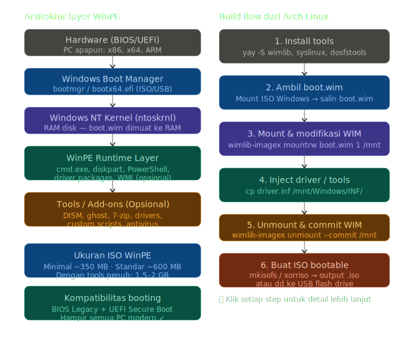
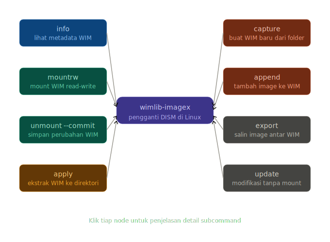

# WinPE



## Apa itu WinPE?

**Windows Preinstallation Environment (WinPE)** adalah versi stripped-down dari sistem operasi Windows yang dirancang khusus untuk berjalan sepenuhnya dari RAM tanpa perlu instalasi ke hard disk. Ia adalah fondasi dari hampir semua proses deployment, recovery, dan forensik berbasis Windows.

Secara teknis, WinPE adalah sebuah **RAM disk** — file `boot.wim` dimuat ke memori saat booting, membentuk filesystem sementara. Begitu masuk ke shell, tidak ada yang ditulis ke disk kecuali kamu sendiri yang melakukannya.

---

## Konsep Inti WinPE

WinPE dibangun di atas tiga pilar utama:

**Windows NT Kernel yang dikurangi** — Semua driver device model Windows kompatibel, namun fitur yang tidak relevan (seperti GUI Aero, registry penuh, atau layanan jaringan kompleks) dibuang untuk efisiensi. Hanya komponen yang diperlukan untuk preinstallation task yang dimuat.

**WIM Image Format** — File `boot.wim` menggunakan format Windows Imaging yang mendukung kompresi LZX dan XPress. Format ini memungkinkan satu file WIM memuat beberapa image sekaligus (multi-index), sehingga satu ISO bisa mendukung x86 dan x64 sekaligus.

**Driver dan package modular** — WinPE dirancang untuk di-inject dengan driver hardware dan optional packages (PowerShell, WMI, scripting host, dll.) sesuai kebutuhan. Ini membuatnya sangat fleksibel.
<!-- di Arch Linux -->
<!---->
<!---->
<!-- ### Persiapan tools -->
<!---->
<!-- ```bash -->
<!-- # Install dari AUR -->
<!-- yay -S wimlib -->
<!-- sudo pacman -S syslinux dosfstools xorriso mtools -->
<!-- ``` -->
<!---->
<!-- ### Ambil boot.wim dari ISO Windows -->
<!---->
<!-- ```bash -->
<!-- # Mount ISO Windows (butuh ISO Windows 10/11 asli) -->
<!-- sudo mkdir -p /mnt/winiso -->
<!-- sudo mount -o loop,ro Win11.iso /mnt/winiso -->
<!---->
<!-- # Salin boot.wim (ini adalah WinPE) -->
<!-- cp /mnt/winiso/sources/boot.wim ~/winpe/ -->
<!-- sudo umount /mnt/winiso -->
<!-- ``` -->
<!---->
<!-- ### Mount dan modifikasi WIM -->
<!---->
<!-- ```bash -->
<!-- # Lihat index yang ada -->
<!-- wimlib-imagex info ~/winpe/boot.wim -->
<!---->
<!-- # Mount index 2 (WinPE setup, biasanya lebih lengkap) -->
<!-- mkdir -p ~/winpe/mount -->
<!-- wimlib-imagex mountrw ~/winpe/boot.wim 2 ~/winpe/mount -->
<!-- ``` -->
<!---->
<!-- ### Inject driver atau tools tambahan -->
<!---->
<!-- ```bash -->
<!-- # Tambahkan driver (format .inf) -->
<!-- cp mydriver.inf ~/winpe/mount/Windows/INF/ -->
<!---->
<!-- # Tambahkan script startup kustom -->
<!-- echo "cmd.exe /k echo Selamat datang di WinPE Custom" \ -->
<!--   > ~/winpe/mount/Windows/System32/startnet.cmd -->
<!-- ``` -->
<!---->
<!-- ### Unmount dan commit perubahan -->
<!---->
<!-- ```bash -->
<!-- wimlib-imagex unmount ~/winpe/mount --commit -->
<!-- ``` -->
<!---->
<!-- ### Buat struktur ISO dan generate ISO bootable -->
<!---->
<!-- ```bash -->
<!-- # Salin file bootloader dari ISO asli -->
<!-- cp -r /mnt/winiso/boot ~/winpe/isoroot/ -->
<!-- cp -r /mnt/winiso/efi  ~/winpe/isoroot/ -->
<!-- mkdir -p ~/winpe/isoroot/sources -->
<!-- cp ~/winpe/boot.wim ~/winpe/isoroot/sources/ -->
<!---->
<!-- # Buat ISO dengan dukungan BIOS + UEFI -->
<!-- xorriso -as mkisofs \ -->
<!--   -o winpe_custom.iso \ -->
<!--   -b boot/etfsboot.com \ -->
<!--   -no-emul-boot -boot-load-seg 0x07C0 -boot-load-size 8 \ -->
<!--   -eltorito-alt-boot \ -->
<!--   -e efi/microsoft/boot/efisys.bin \ -->
<!--   -no-emul-boot \ -->
<!--   ~/winpe/isoroot/ -->
<!-- ``` -->
<!---->
---

## Ukuran ISO WinPE

Ukuran sangat bergantung pada konten yang di-inject:

| Varian | Ukuran |
|---|---|
| WinPE minimal (boot.wim saja) | ~350–450 MB |
| WinPE standar (+ PowerShell, WMI) | ~600–800 MB |
| WinPE penuh dengan tools recovery | 1.2–2 GB |
| WinPE dengan GUI (Gandalf's, dll.) | 2–4 GB |


## Apakah Bisa Diboot di PC Apapun?

**Jawabannya: Ya, dengan syarat teknis yang perlu diperhatikan.**

WinPE yang dikompilasi untuk arsitektur **x64** akan berjalan di hampir semua PC modern yang memiliki prosesor 64-bit. Ia mendukung boot via **BIOS Legacy** maupun **UEFI**, termasuk UEFI dengan Secure Boot jika image-nya ditandatangani (seperti dari Microsoft resmi).

Beberapa hal yang bisa menjadi kendala:

**Driver hardware** — Jika PC memiliki storage controller (misalnya NVMe dengan driver spesifik) atau NIC yang tidak ada drivernya di dalam WIM, maka disk atau jaringan tidak akan terdeteksi — tapi WinPE tetap berhasil boot. Solusinya adalah inject driver sebelum membuat ISO.

**Secure Boot ketat** — ISO yang kita buat sendiri secara default tidak memiliki signature Microsoft, sehingga perlu menonaktifkan Secure Boot di BIOS/UEFI untuk menggunakannya.

**Arsitektur** — WinPE x64 tidak bisa boot di mesin x86 murni (32-bit), tapi ini sudah sangat langka di dunia modern. Untuk ARM (seperti Surface Pro X), diperlukan build WinPE ARM64 terpisah.

Secara praktis, jika kamu menggunakan `boot.wim` langsung dari ISO Windows 10/11 resmi dan menonaktifkan Secure Boot, **WinPE tersebut akan berjalan di hampir 100% PC dan laptop modern** tanpa masalah berarti.

---

# Wimlib-Imagex?



## Apa itu wimlib-imagex?

`wimlib-imagex` adalah implementasi open-source dari tool Microsoft `imagex.exe` dan `DISM.exe` — dua tool utama yang digunakan untuk memanipulasi file `.wim` (Windows Imaging Format) di ekosistem Windows. Di Linux, khususnya Arch Linux, ini adalah satu-satunya cara yang reliable untuk membuat, memodifikasi, mount, dan mengekstrak WIM image tanpa harus menggunakan Wine atau VM Windows.

Secara teknis, `wimlib` adalah library C yang menjadi backend-nya, sementara `wimlib-imagex` adalah binary CLI yang mengekspos semua fungsionalitas library tersebut. Format file `.wim` sendiri menggunakan kompresi LZX (sama seperti cabinet file Windows), mendukung deduplication data secara native, dan mampu menyimpan multiple image dalam satu file.

<!-- --- -->
<!---->
<!-- ## Instalasi di Arch Linux -->
<!---->
<!-- Arch Linux memiliki dua jalur instalasi tergantung kebutuhan: -->
<!---->
<!-- ### Jalur 1 — Dari Official Repository (Recommended) -->
<!---->
<!-- ```bash -->
<!-- # wimlib tersedia langsung di repo official Arch -->
<!-- sudo pacman -S wimlib -->
<!-- ``` -->
<!---->
<!-- Ini menginstal binary `wimlib-imagex` beserta library `libwim.so`. Versi ini sudah cukup untuk semua operasi WinPE standar. -->
<!---->
<!-- ### Jalur 2 — Dari AUR (Versi Lebih Baru) -->
<!---->
<!-- Jika membutuhkan fitur terbaru atau patch tertentu: -->
<!---->
<!-- ```bash -->
<!-- # Menggunakan yay -->
<!-- yay -S wimlib-git -->
<!---->
<!-- # Atau menggunakan paru -->
<!-- paru -S wimlib-git -->
<!-- ``` -->
<!---->
<!-- ### Verifikasi instalasi -->
<!---->
<!-- ```bash -->
<!-- # Cek versi yang terinstal -->
<!-- wimlib-imagex --version -->
<!---->
<!-- # Lihat semua subcommand yang tersedia -->
<!-- wimlib-imagex --help -->
<!-- ``` -->
<!---->
<!-- Output yang diharapkan kurang lebih seperti ini: -->
<!---->
<!-- ``` -->
<!-- wimlib-imagex (wimlib) 1.14.x -->
<!-- ... -->
<!-- Available subcommands: -->
<!--   append        Append an image to a WIM file -->
<!--   apply         Extract an image from a WIM file -->
<!--   capture       Create a WIM file from a directory -->
<!--   ... -->
<!-- ``` -->
<!---->
<!---->
<!-- ## Perintah Esensial untuk Workflow WinPE -->
<!---->
<!-- Setelah terinstall, berikut perintah-perintah yang paling sering digunakan dalam konteks pembuatan WinPE: -->
<!---->
<!-- **Melihat informasi WIM:** -->
<!-- ```bash -->
<!-- wimlib-imagex info boot.wim -->
<!-- ``` -->
<!---->
<!-- Menampilkan jumlah image dalam file WIM, nama masing-masing image, ukuran sebelum dan sesudah kompresi, serta arsitektur target. -->
<!---->
<!-- **Mount image untuk diedit:** -->
<!-- ```bash -->
<!-- mkdir -p /mnt/winpe -->
<!-- wimlib-imagex mountrw boot.wim 2 /mnt/winpe -->
<!-- ``` -->
<!---->
<!-- Angka `2` adalah index image yang akan di-mount. Index 1 biasanya Windows Setup, index 2 adalah WinPE environment. -->
<!---->
<!-- **Simpan perubahan dan unmount:** -->
<!-- ```bash -->
<!-- wimlib-imagex unmount /mnt/winpe --commit -->
<!-- ``` -->
<!---->
<!-- Flag `--commit` wajib disertakan — tanpanya semua perubahan yang kamu buat di dalam mount point akan dibuang. -->
<!---->
<!-- **Ekstrak WIM ke direktori:** -->
<!-- ```bash -->
<!-- wimlib-imagex apply boot.wim 2 /output/dir/ -->
<!-- ``` -->
<!---->
<!-- Berguna untuk inspeksi file system WinPE tanpa perlu mount. -->
<!---->
<!-- **Buat WIM baru dari direktori:** -->
<!-- ```bash -->
<!-- wimlib-imagex capture /source/dir/ output.wim "WinPE Custom" \ -->
<!--   --compress=LZX -->
<!-- ``` -->
<!---->
---

## Perbandingan wimlib-imagex vs DISM

| Fitur | `wimlib-imagex` (Linux) | `DISM.exe` (Windows) |
|---|---|---|
| Platform | Linux, macOS, Windows | Windows only |
| Mount WIM | Ya (`mountrw`) | Ya (`/Mount-Image`) |
| Inject driver | Manual (copy file) | Native (`/Add-Driver`) |
| Kompresi | LZX, XPRESS, LZMS | LZX, XPRESS, LZMS |
| Speed | Sangat cepat | Lebih lambat |
| Lisensi | GPL v3 (free) | Proprietary |

Satu hal yang perlu diperhatikan: `wimlib-imagex` tidak memiliki perintah `add-driver` secara native seperti DISM. Namun efeknya sama — kamu cukup menyalin file driver ke dalam direktori yang sudah di-mount, dan Windows akan mengenalinya saat boot. Fleksibilitas ini justru menjadi kekuatan karena kamu punya kontrol penuh atas struktur file system WinPE.


---

## Cara Membuat WinPE

Di Linux, kita tidak memiliki Windows ADK secara native, namun bisa menggunakan `wimlib` sebagai pengganti DISM. Tutorial berikut akan mengambil contoh dari pembuatan melalui **[Manjaro berbasis Archlinux][arch]**

[arch]: ./arch/winpe_arch.md
